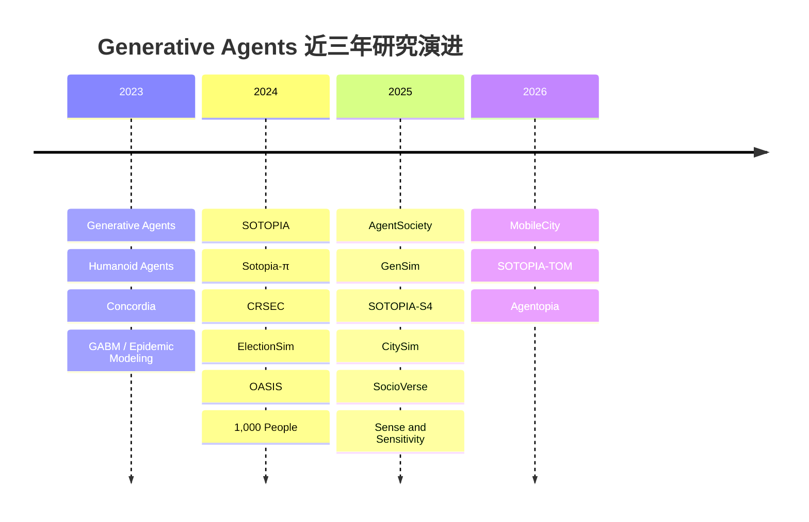
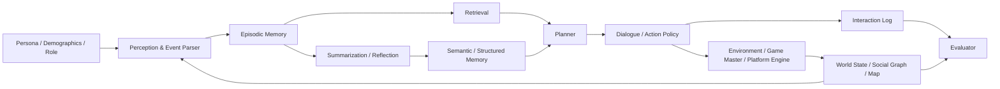

# Generative Agents 研究现状、开放问题与小型研究团队路线图

## 执行摘要

过去三年里，**Generative Agents** 已经从一个以 Smallville 为代表的“会生活、会聊天、会传消息的虚拟小镇”原型，演化成了一个横跨 **社会交互评测、社会规范与信息传播、多智能体社会仿真、城市与平台级行为模拟** 的研究簇。这个方向的共同点，不是“让 LLM 会聊天”，而是把 LLM 包装成**有角色、有记忆、有计划、能与环境和他人持续互动**的社会性智能体；它正在从 demo 驱动，逐步走向**评测驱动、环境驱动、规模驱动**。代表性节点包括 Stanford 的 Generative Agents、DeepMind 的 Concordia、CMU/CMU+CMU 的 SOTOPIA、AgentSociety、OASIS、CitySim、MobileCity、SocioVerse 等。citeturn0academia48turn3academia24turn1academia46turn25search0turn12academia12turn26search0turn25search1turn11academia33

这个领域**已经可靠做到**的事情，主要集中在：短期多轮对话、角色扮演、受限场景下的社交协商、带有外部记忆与反思的日程规划、某些宏观现象的再现（例如信息传播、极化、信任游戏行为、部分问卷回答复现）。但它**还没有可靠做到**：稳定的长期人格一致性、跨场景可迁移的“类人社会性”、真正可信的长期记忆利用、复杂信息不对称下的隐私与协调、对现实世界因果机制的可验证替代。现有研究一方面显示 LLM agents 在部分社会任务上有明显能力，另一方面也显示其对提示词、评测器、环境设定和模型版本非常敏感。citeturn1academia46turn2academia27turn12academia14turn16academia12turn4academia26turn6academia44turn21academia44turn21academia51

从技术上看，这个方向的“核心竞争力”并不主要来自再训练一个更大的模型，而是来自**系统架构**：怎样做记忆分层、怎样触发 reflection、如何将语言行动 grounded 到空间/社交/平台环境、如何做多 agent 通讯与状态更新、以及如何评估这些行为究竟是“像人”、还是只是“像 prompt”。Concordia 用 Game Master 模式把动作落到物理/社会/数字环境中；SOTOPIA 把重点放到社会智能评测；OASIS 和 AgentSociety 把重点放到大规模社会平台与城市环境；CitySim 和 MobileCity 则把 generative agents 推向更强的空间与城市行为模拟。citeturn22view0turn1academia46turn23view4turn25search0turn26search0turn25search1

对你这种**中文环境、个人研究者、没有很多本地 GPU、但可购买 API** 的情况，最佳策略不是去卷“超大规模社会世界”或“训练自己的基础模型”，而是聚焦于**可验证的小问题**：例如结构化社会记忆、中文社会互动评测、信息不对称下的社会协调、空间环境如何改变社交行为、环境 grounding 如何提升一致性与可复现性。现在最现实的工程范式是：**API 做高价值决策 + 本地开源模型做廉价整理/总结/过滤 + CPU 级 embedding + 轻量数据库/向量库**。Concordia、SOTOPIA、AgentSociety、AI Town、Humanoid Agents 都已经证明，小团队完全可以用 API-first 的方式做出研究级系统；而 Qwen、Ollama、all-MiniLM-L6-v2、pgvector 则让“本地便宜组件 + 云端强模型”的混合管线可行。citeturn22view0turn23view0turn23view2turn23view5turn23view6turn17search1turn19search0turn17search0turn20search2

我的总判断是：**Generative Agents 已经从“一个漂亮 demo”发展成了“一个有研究密度但仍未形成统一科学范式的方向”**。它目前最有价值的，不是替代社会科学和现实实验，而是成为一种**可控、低成本、可快速迭代的中观实验平台**。因此，小型研究团队最值得投入的方向，不是“做更大”，而是“做更可证伪、更可复现、更能量化比较”。citeturn16academia14turn16academia12turn6academia48turn21academia44

## 时间线与里程碑

如果把最近三年的演化压缩成一句话，可以概括为：

**创始架构阶段**：证明“带记忆、反思、计划的 agent 社会”可跑起来。  
**评测与规范阶段**：开始认真衡量“它是否真的社会智能，是否真的一致，是否真的有规范”。  
**规模化与环境阶段**：把 agent 放进更真实的数字平台、城市环境、多方交互和大规模人群模拟里。citeturn0academia48turn1academia46turn24academia38turn25search0turn26search0turn25search1

上面的时间线对应的核心里程碑，可以按“研究作用”来理解。

**Generative Agents** 是这个研究簇的奠基之作。它把 LLM 扩展成一个包含记忆流、反思和计划的 agent 架构，并在 Smallville 式环境中展示了 25 个代理的个体行为与社会涌现，例如派对邀请扩散、约会协调等。它的重要性不在于世界有多大，而在于它提出了此后几乎所有系统都在复用或变体化的基本循环：**观察—记忆—检索—反思—计划—行动**。citeturn0academia48turn13search2

**Humanoid Agents** 很早就指出，单纯的 System-2 风格推理不够，人类社会行为还受到需求、情绪、亲密关系等“System-1 风格状态变量”驱动。它把 hunger、health、energy、emotion、relationship closeness 等动态变量引入 agent，并提供了 WebGL 与分析仪表盘。这条路线非常重要，因为它预示了后来很多“更像人”的社会 agent 系统，都开始把纯文本 memory 扩展成**文本记忆 + 数值状态 + 关系状态**的混合表征。citeturn10academia36turn23view6

**Concordia** 的价值是把 generative social simulation 从一个特定 demo，提升为一种**可编排、可复用的研究基础设施**。它用 Game Master 模式把 agent 行动落到“物理、社会或数字环境”中，把实体、组件和引擎解耦，形成一种更通用的社会仿真设计模式。对后续研究来说，Concordia 的意义相当于：从“一个小镇 demo”走向了“一个能搭建很多不同社会实验的引擎”。citeturn3academia24turn22view0

**SOTOPIA** 把社会智能评测系统化了。它不是单纯让 agent 自己玩，而是构造社会场景、关系、目标以及多维评分框架，考察模型在协作、交换、竞争、保密、规范遵循等方面的表现。SOTOPIA 的关键贡献，是把“社会智能”从主观 demo 感受，推进成了**可比较、可迭代优化的 benchmark**；Sotopia-π、SOTOPIA-S4、SOTOPIA-TOM 则进一步把这个方向推进到了训练、系统化部署、多方信息不对称评估。citeturn1academia46turn1academia47turn27search2turn21academia51

**CRSEC** 代表了“社会规范 emergence”这条线。它把规范分成 Creation/Representation、Spreading、Evaluation、Compliance 四个模块，并在 Smallville 类环境中显示规范形成和冲突减少。它说明这个领域不只是“对话”和“日程安排”，还开始认真研究**规则、制裁、传播、合规**这些典型社会科学问题。citeturn24search1turn24search0

**ElectionSim、OASIS、AgentSociety、SocioVerse** 代表的是“大规模社会/平台仿真”路线。ElectionSim 建立百万级选民池并评估选举场景；OASIS 面向社交媒体环境，支持百万 agent、动态社交图、推荐系统和多种用户动作；AgentSociety 把 realistic environment 和 parallel execution 结合起来，在 ACL 工业轨报告中展示了 30,000 agents、24 张 A800、快于墙钟时间的模拟能力；SocioVerse 则进一步强调与真实用户池和目标人群的对齐。它们共同表明，这个领域正在从“几十个 agent 的小镇”走向“平台级、社会级、城市级”仿真。citeturn12academia13turn12academia12turn25search0turn11academia33

**Generative Agent Simulations of 1,000 People** 是另一个重要转折点。它不是继续做合成 NPC，而是尝试模拟 1,052 个真实个体，使用定性访谈来构建 persona，并检验这些“代理人”在 General Social Survey、人格与实验复现上的行为匹配度。论文报告称，该架构在问卷回答复现上达到真实参与者两周后自我复答准确度的 85%。这条线很关键，因为它把 generative agents 从“虚拟世界表演”推进到了**现实个体代理与社会科学替身**的争议前沿。citeturn12academia14

**CitySim 与 MobileCity** 标志着空间/城市行为模拟正在成为一个独立分支。CitySim 让 agent 具有 beliefs、long-term goals 和 spatial memory，在城市环境中生成更真实的日程与导航行为；MobileCity 则进一步强调 cognitively-grounded agents、survey-based demographics、multimodal transportation network，以及为了扩展性而设计的 asynchronous batched inference 和 low-token communication。对于有建筑、城市、空间研究兴趣的研究者，这是一个非常值得关注的前沿分支。citeturn26search0turn25search1

与此同时，**反思性、批判性评估**也在增强。Sense and Sensitivity 指出，LLM 社会仿真对 prompt wording 甚至空格都可能高度敏感；行为一致性研究指出，agent 可能表面上匹配某些人类分布，但内部状态与外显行为并不一致；Too Human to Model 则从建模哲学上警告：LLM agent 过于“像人”并不自动等于更适合做科学模型。换句话说，这个领域的系统能力在快速增长，但其**科学有效性和方法论自洽**仍然远未解决。citeturn16academia12turn6academia44turn6academia48

### 代表性系统对比

下表中的“API 友好”和“成熟度”是基于论文与官方仓库要求做的工程判断；它们不是论文自报指标，而是本报告为了帮助小团队选题与选栈而给出的实践性分类。相关事实依据来自表中引用的论文、官方 repo 与文档。citeturn22view0turn23view0turn23view2turn23view4turn23view5turn23view6turn23view8

| 名称 | 年份 | 核心想法 | 记忆 / 反思 / 规划 | 环境类型 | 开源 | API 友好 | 成熟度 |
|---|---:|---|---|---|---|---|---|
| Generative Agents citeturn0academia48turn13search2 | 2023 | 用记忆流、反思、计划驱动 Smallville 社会行为 | 显式 memory stream + reflection + daily planning | 2D 小镇沙盒 | 是 | 中 | 奠基原型 |
| Humanoid Agents citeturn10academia36turn23view6 | 2023 | 在 generative agents 中加入需求、情绪、关系等 System-1 变量 | 文本记忆 + needs/emotion/relationship 状态 + 日程 | 家庭/剧情式空间 | 是 | 中 | 可复现实验原型 |
| Concordia citeturn3academia24turn22view0 | 2023 | 用 Game Master 统一物理/社会/数字环境 grounding | 组件化 memory/reasoning/planning，可自定义 | 物理/社会/数字环境 | 是 | 是 | 研究基础设施 |
| SOTOPIA citeturn1academia46turn23view0 | 2024 | 面向社会智能的交互评测环境 | 取决于 agent；框架重点是 scenario + eval | 文本场景交互 | 是 | 是 | 标准评测平台 |
| CRSEC citeturn24search1turn24search0 | 2024 | 面向社会规范 emergence 的四模块架构 | 规范创建/传播/评估/合规纳入 planning | Smallville 类沙盒 | 是 | 中 | 研究型扩展 |
| OASIS citeturn12academia12turn23view4 | 2024 | 面向社交媒体的大规模平台仿真 | persona + 平台状态 + 行动策略 | Reddit/X 类社交平台 | 是 | 中 | 大规模平台原型 |
| 1,000 People citeturn12academia14 | 2024 | 用真实访谈构建个体 agent，检验行为复现 | persona-grounded memory/behavior simulation | 问卷与实验任务环境 | 论文为主 | 是 | 科学验证里程碑 |
| AgentSociety citeturn4academia27turn25search0turn23view2 | 2025 | 真实环境 + 并行引擎 + 城市/社会实验 | 规划/记忆/推理与 realistic environment 耦合 | 城市/经济/社会环境 | 是 | 小规模可，超大规模不友好 | 大规模研究平台 |
| GenSim citeturn2academia24turn6search0 | 2025 | 抽象通用社会仿真函数，支持纠错与大规模 | 通用函数化 agent loop + error correction | 通用社会仿真 | 论文/系统 demo | 中 | 系统化框架 |
| SOTOPIA-S4 citeturn27search2turn27academia45 | 2025 | 把 SOTOPIA 做成 pip 包 + API server + Web UI | 可配置 eval、multi-turn/multi-party orchestration | 文本社会场景 | 是 | 是 | 工具化系统 |
| CitySim citeturn26search0 | 2025 | 城市尺度的 beliefs、长期目标、空间记忆仿真 | beliefs + long-term goals + spatial memory | 虚拟城市 | 论文为主 | 中 | 城市行为前沿 |
| SocioVerse citeturn11academia33 | 2025 | 用千万真实用户池对齐社会模拟 | 四类 alignment 组件 + 大规模 user pool | 政治/新闻/经济社会世界 | 未见官方开源 | 否 | 大规模社会模型 |
| MobileCity citeturn25search1 | 2026 | 更高效的城市生成式 agent 仿真 | cognitively-grounded state + batched inference | 多模态交通城市网络 | 论文称开源 | 中 | 新一代高效城市框架 |
| SOTOPIA-TOM citeturn21academia51 | 2026 | 针对信息不对称与隐私管理的多方社会评测 | 多方私有知识 + channel-aware interaction | 多方社会协作场景 | 基于 SOTOPIA 生态 | 是 | 新 benchmark |
| Agentopia citeturn3academia27 | 2026 | 研究“长达十年”的 life simulation 与从社会经验中学习 | life reward + long-term life simulation | 长时社会生活世界 | 论文新近发布 | 否 | 前沿探索 |

## 技术架构

当前 Generative Agents 研究里的“技术核心”，已经从单个 prompt 设计，上升到了**系统架构设计**。主流系统虽然名字不同，但越来越像一台分层机器：底层负责事件、状态、空间与社会关系的更新；中层负责记忆、检索、压缩和反思；上层负责计划、对话、行动与评估；外围再接数据库、向量化、环境引擎和日志分析。Generative Agents、Concordia、Humanoid Agents、CitySim 与 AgentSociety 都体现了这一点，只是它们侧重的层次不同。citeturn0academia48turn22view0turn10academia36turn26search0turn4academia27

### 一个适合小团队复用的架构图建议

这个图对应的第一个关键问题，是**记忆怎么建模**。早期 Generative Agents 使用的是“自然语言 memory stream + relevance/recency/importance 检索 + reflection 生成高阶记忆”；Concordia 则把 memory 和 reasoning 变成可插拔组件；Humanoid Agents 在文本记忆之外加入需求、情绪和关系变量；CitySim 把 beliefs、long-term goals 和 spatial memory 纳入 agent；而很多大规模系统还会把 profile、行为习惯、平台日志、关系图、POI/道路图作为并行记忆源。最新的 memory benchmark 也说明，真正困难的不是“能否记住一句话”，而是**能否在多轮持续交互中主动使用、更新、组织和遗忘记忆**。citeturn0academia48turn22view0turn10academia36turn26search0turn21academia44turn5academia12turn5academia14

第二个关键问题，是**reflection / planning loop 怎么触发**。Generative Agents 的经典做法是先观察并写入记忆，再根据重要性阈值生成反思，再在日级别做计划、在事件级别做重规划。后续系统大体沿着三种方向演化：一类保持“周期性反思 + 分层计划”；一类弱化显式 reflection，转向 structured states 和 heuristics；另一类则把长期目标、价值或 reward 直接纳入规划，例如 CitySim 的 recursive value-driven 日程生成，或者 Agentopia 的 life reward 训练。这个方向的经验已经非常清楚：**没有显式的记忆更新和计划重组，agent 很难维持长时社会行为；但 reflection 太频繁又会极大增加成本并引入自我幻觉。**citeturn0academia48turn26search0turn3academia27turn16academia12

第三个关键问题，是**检索与存储**。研究系统里常见的存储实现并不豪华：SOTOPIA 官方就支持 Redis 和本地 JSON 两种后端；Concordia 只要求 standard LLM API 和 text embedder；AgentSociety 也把 LLM provider 抽象成 litellm 兼容层。工程上最常见的模式其实是：短期状态存在运行时对象里，中长期记忆存在 JSON/SQLite/Postgres/Redis/向量库里，检索时做 embedding 相似度 + recency/importance rerank，再交给模型。对小团队而言，没必要一开始就上分布式向量数据库，**pgvector、SQLite 或者项目内 JSON store 已经足够支撑论文级实验**。citeturn23view1turn22view0turn23view2turn20search2

第四个关键问题，是**grounding**。这一领域已经越来越清楚地认识到，纯文本 agents 很难真正研究社会行为。Concordia 的 Game Master、OASIS 的动态社交图与推荐系统、AgentSociety 的 realistic environment、CitySim/MobileCity 的空间导航与多模态交通网络，都是在回答同一个问题：agent 的行动必须落在一个有约束、有反馈、有状态更新机制的世界里，否则所谓“社会性”大部分只是高流畅度对话。也正因为如此，环境设计本身已经成为研究贡献的一部分，而不再只是可视化背景板。citeturn22view0turn23view4turn25search0turn26search0turn25search1

第五个关键问题，是**多智能体交互机制**。在 SOTOPIA 这类评测环境里，交互主要是场景化、多轮、目标导向对话；在 OASIS 里，交互是 follow/comment/repost 等平台动作；在 AgentSociety、CitySim 和 MobileCity 里，交互还包括移动、相遇、设施使用、交通选择和宏观扰动响应；在 SOTOPIA-TOM 里，研究重点已经推进到多方场景中的私有信息、广播/私信通道选择、隐私泄漏与协作效率。换句话说，当前最像“下一阶段 frontier”的，不是让 agent 多说几句话，而是让它们在**带信息不对称、带空间摩擦、带传播机制、带制度约束**的环境里互动。citeturn1academia46turn23view4turn4academia27turn26search0turn25search1turn21academia51

第六个关键问题，是**评估指标**。这个领域还没有统一指标，但已经形成了几类常见尺度。微观层面评估单轮/多轮行为质量、目标完成率、社交礼仪、隐私与安全、记忆检索准确率；中观层面评估社会网络结构、扩散路径、规范形成、协商结果和群体差异；宏观层面评估是否接近真实数据分布、是否能复现实验方向、是否对政策干预与环境扰动有合理响应。SOTOPIA 与 SocialEval 分别强调互动社会智能评分；MemoryAgentBench 和 Mem2ActBench 强调长期记忆；1,000 People 强调与真实个体行为的一致性；AgentSociety、CitySim、MobileCity 则更关注宏观行为和现实环境指标；Sense and Sensitivity 则提醒我们，没有 reference model 的情况下，很多宏观结果其实难以解释。citeturn1academia46turn21academia45turn21academia44turn5academia12turn12academia14turn4academia27turn26search0turn25search1turn16academia12

## 工程现实与工具链

### 计算与数据需求的真实情况

对小团队来说，最好的消息是：**这个方向大多数系统并不要求你本地训练大模型。** Concordia 明确要求的是标准 LLM API 加一个 text embedder；SOTOPIA 默认需要 OpenAI API key，但也支持本地 JSON 存储；AgentSociety 需要 Python 3.11 与一个 LLM API key；Humanoid Agents 同时支持 OpenAI 和本地 provider；AI Town 本质上就是一个可部署的 starter kit。换句话说，**Generative Agents 研究的主要成本通常是推理调用与系统工程，而不是模型训练**。citeturn22view0turn23view1turn23view2turn23view6turn23view5

数据方面，主流项目通常需要四类输入：角色/人口画像、环境结构、交互规则和评测集。Smallville/AI Town 这类系统可以用手写 persona 和地图直接启动；SOTOPIA 提供 scenario、角色与关系框架；OASIS 与 AgentSociety 需要更强的平台/城市环境；1,000 People、ElectionSim、SocioVerse 则进一步绑定真实访谈、用户池、问卷或平台数据。对个人研究者而言，真正昂贵的不是“拿不到数据”，而是**拿到数据之后如何构造一个可验证的实验闭环**。citeturn23view5turn23view0turn23view4turn4academia27turn12academia14turn12academia13turn11academia33

### API 与本地模型的取舍

在你这种资源条件下，最合理的不是二选一，而是**分层使用**。

如果全部依赖云端 API，优点是推理质量更稳、更强，尤其在复杂社交推理、长上下文和 evaluator 角色上；缺点是成本、速率限制、模型漂移和可复现性压力。Anthropic 官方文档明确说明 API 有组织级 usage tiers，并按 RPM、输入 TPM、输出 TPM 控制速率；OpenAI 与 Anthropic 都提供 Batch 折扣，而 Anthropic 还明确提供 prompt caching 价格规则。这意味着：当你把社会仿真当成“几万到几十万次调用”的实验工程时，**批处理、缓存和重用系统 prompt** 不是优化项，而是生存项。citeturn9search1turn8search0turn28search0

如果引入本地开源模型，优点是边际成本低、私密性高、可离线、可固定版本；缺点是社会推理质量、长时一致性和工具调用稳定性通常不及更强 API 模型。工程上最现实的用法不是“让本地模型包办一切”，而是让本地模型承担**低价值但高频**的工作：摘要、记忆压缩、标签生成、粗过滤、简单对话、候选行动生成；再把**高价值但低频**的步骤，例如关键谈判、反思生成、最终 action resolve、评测裁判，交给云端强模型。Ollama 官方文档和 GitHub 仓库已经把本地模型部署门槛降得很低，Qwen2.5-7B-Instruct 官方模型卡则提供了强中文支持、128K 上下文与较好的结构化输出能力；而 all-MiniLM-L6-v2 这类 embedding 模型可以直接在 CPU 上做出足够实用的语义检索。citeturn19search0turn23view8turn17search1turn17search0

### 一个适合个人研究者的最小技术栈

如果你的目标是“尽快做出可发表的实验平台”，我建议最小栈如下：

**认知层**：一个主力 API 模型 + 一个低价本地模型。主力模型可用较强商用 API 执行关键社交决策；本地模型可用 Ollama 托管的 Qwen 做总结、记忆压缩、embedding 辅助任务或低成本 agent。citeturn28search0turn8search0turn19search0turn17search1

**记忆层**：本地 sentence embeddings + pgvector 或 SQLite/JSON。all-MiniLM-L6-v2 是稳妥的 CPU 级 embedding 起点；pgvector 让你把向量和实验元数据放在同一个 Postgres 里；若只是原型，SOTOPIA 官方已经表明 local JSON 可用于开发/测试。citeturn17search0turn20search2turn23view1

**仿真层**：如果你要做社会互动评测，优先从 SOTOPIA 或 SOTOPIA-S4 起步；如果你要做环境 grounding，优先从 Concordia 起步；如果你要做“看得见、能交互”的演示与快速原型，AI Town 很适合；如果你偏城市/社会实验，AgentSociety 是更重但更系统的参考。citeturn23view0turn27search2turn22view0turn23view5turn23view2

### 成本估算与预算感知

从官方价格看，OpenAI 当前价格页列出了不同旗舰模型与 mini 模型的输入/输出价格，并明确提供 Batch API 约 50% 折扣；Anthropic 文档同样给出 Sonnet/Haiku/Opus 系列的按 token 定价与 Batch 折扣。例如，Anthropic 文档显示 Claude Sonnet 4 标准价约为 **$3 / 百万输入 token** 与 **$15 / 百万输出 token**，Batch 可减半；OpenAI 当前定价页显示低价 mini 档模型大约可以做到 **不到 $1 / 百万输入 token** 与 **几美元 / 百万输出 token** 的量级，并同样支持缓存和批处理。citeturn28search0turn8search0

把上面的价格换成研究预算，结论其实很现实：如果你把 agent 仿真控制在**结构化事件驱动**而不是“持续聊天挂机”，10M–50M 输入 token、2M–10M 输出 token 的月度实验规模，在低价 mini 档模型上通常只需要**几十到一百多美元量级**；如果你用 Sonnet 级别模型做主力，可能会上升到**数百美元量级**。但这只是理论估算。真实系统往往比账面更贵，因为社会仿真里系统 prompt、角色上下文、memory retrieval、world state、tool schema 等都会持续膨胀。Humanoid Agents 官方仓库给出的经验值是：只模拟 **2–3 个 agent 的一天**，就可能消耗 **$2–5**，而且耗时 **45–60 分钟**。这说明如果不做 prompt 压缩、层级调度和缓存，成本会迅速失控。citeturn8search0turn28search0turn23view6

因此，最重要的工程原则不是“选哪个模型”，而是三条：**减少不必要反思、把摘要与记忆压缩下放到便宜模型、把持续世界更新改成事件驱动而不是固定 tick 驱动**。CitySim 与 MobileCity 所体现的 batched inference、low-token communication，本质上也在沿着这个方向优化。citeturn26search0turn25search1

## 经验成熟度

### 已经相对可靠的能力

**短期多轮社交对话** 已经是这个方向里最稳定的能力之一。无论是 Generative Agents 里的派对邀请传播，还是 SOTOPIA 里的协商、合作与竞争任务，还是 Humanoid Agents 里加入情绪/亲密关系后的对话变化，现有模型在**受限场景、明确定义角色与目标**的条件下，已经能够稳定地产生高可读性、看起来合理、在局部上具有连贯性的社交交互。citeturn0academia48turn1academia46turn10academia36

**带有外部记忆的短到中期一致性** 也已经基本可用。Generative Agents 的 memory stream 与 reflection，Concordia 的 componentized memory，CitySim 的 beliefs/long-term goals/spatial memory，说明只要你把记忆显式外置并做检索，agent 在几十轮、几个会话、一天到数天的仿真中，通常可以维持基本角色一致和状态延续。对于产品级 demo、研究型原型和有限 horizon 的社会实验，这已经够用。citeturn0academia48turn22view0turn26search0

**某些局部社会现象的涌现** 也已经有相当多正结果。CRSEC 展示了规范生成与冲突减少；OASIS 展示了信息传播、极化与 herd effects；AgentSociety 展示了极化、煽动性信息传播、UBI、飓风冲击等实验；CitySim 与 MobileCity 展示了群体出行、拥挤、地点受欢迎程度和幸福度等宏观指标。只要环境约束设计得足够明确，agent society 确实已经能在某些中观层面表现出稳定模式。citeturn24search1turn12academia12turn4academia27turn26search0turn25search1

**某些特定人类行为的对齐** 也并非空谈。Trust Game 研究发现，在这个特定行为维度上，GPT-4 agent 的 trust behavior 与人类存在较高行为对齐；1,000 People 则在 survey/personality/experimental replications 上迈出了更激进的一步，尝试用访谈驱动的 agents 去复现真实人的回答与偏好。换句话说，现阶段最靠谱的结论不是“LLM 已经能模拟整个人类社会”，而是“**在一些窄而清晰的行为维度上，它已经开始接近实用**”。citeturn2academia27turn12academia14

### 仍然经常失败的能力

**长期记忆的主动使用** 仍然远远不稳。MemoryAgentBench 与 Mem2ActBench 都说明，很多 agent memory 方法能“找到旧信息”，却不能在复杂任务里**主动、恰当地把它转成行动参数和决策依据**。这对社会仿真尤其致命，因为社会行为里大量关键信息不是被直接问到的，而是需要 agent 主动记住并转化为“此刻该怎么做”。citeturn21academia44turn5academia12

**真正的长期一致性和内部一致性** 也依然薄弱。行为一致性研究指出，agent 可能在某些数据集或任务里看起来像某一类人，但当你换一个实验设置、换一种 probing 方法，模型的显性行为与“它自己表露的内部状态”并不一致。Dictator Game 研究也发现，仅仅给模型一个“像人的身份”并不会稳定地产生像人的决策过程。也就是说，现阶段很多成功更像是**任务拟合**，而不是稳定人格。citeturn6academia44turn4academia26

**复杂信息不对称、多方协调与隐私管理** 是当前很明显的短板。SOTOPIA-TOM 专门把多方私有知识、广播/私信通道、共享策略与隐私违规纳入评估，结果显示即使较强模型也仍有显著缺陷。对于现实社会系统来说，这类缺陷不是边角问题，而是核心问题，因为真实组织和社会的大量互动都依赖“知道什么、该告诉谁、什么时候说、隐私边界在哪里”。citeturn21academia51

**对环境与提示的稳健性** 同样很差。Sense and Sensitivity 的一个关键结论是：如果没有 reference model，系统对 prompt wording 乃至 whitespace 的敏感性足以动摇仿真的解释价值。换句话说，很多论文展示出来的“宏观社会现象”，在方法论上仍然可能是 fragile engineering artifact，而不一定是可信的社会机制。citeturn16academia12

**多模态、真实世界 grounding 的社会 agent** 目前还只是前沿预研。大多数系统仍以文本或结构化状态为主；即便最近出现了 visually-grounded humanoid agents、更强城市/平台模拟器，它们更多代表研究前沿，而不是“普通研究组可直接稳定复现”的成熟能力。citeturn10academia47turn11academia35

## 关键挑战

**量化评估** 仍然是头号挑战。SOTOPIA、SocialEval、MemoryAgentBench、SOTOPIA-TOM 已经把评测往前推进很多，但这个方向仍然缺少像计算机视觉那样统一、共识高、难被 evaluator bias 污染的标准。特别是在开放式社会交互里，goal completion、礼貌、策略、隐私、规范、长期关系这些维度往往彼此冲突，导致“评得出来”和“评得对”之间差距很大。Sotopia-π 甚至直接指出，LLM-based evaluator 会高估为社会交互专门训练过的模型。citeturn1academia46turn21academia45turn21academia44turn21academia51turn1academia47

**规模化** 是第二个大问题。大多数令人印象深刻的社会仿真 demo，往往在 agent 数、时间跨度、环境复杂度和模型质量之间做了大量隐性妥协。AgentSociety 的 ACL 工业轨结果显示，要做到 30,000 agents 并快于墙钟时间，需要 24 张 A800；OASIS 和 GenSim 强调百万/十万级能力，但真正高质量 LLM cognition 若全面上云，成本极高。换句话说，**大规模“代理数量”并不自动等于大规模“高质量认知”**。citeturn25search0turn12academia12turn2academia24

**一致性与可解释性** 是第三个问题。随着系统越来越“像人”，它们也越来越难分析。Too Human to Model 的批评非常值得重视：建模领域需要抽象、简化和机制清晰，而 LLM agents 往往输出过度丰富、过度语义化，反而可能遮蔽机制。对社会科学而言，一个“看起来很真实”的 agent society，未必比一个简单但透明的 rule-based ABM 更有解释价值。citeturn6academia48

**grounding 与多模态** 是第四个问题。Concordia、CitySim、MobileCity 和 OASIS 都在努力把行为与环境绑定，但绝大多数系统仍停留在文本世界或浅层状态机层面。只要 agent 不真正受空间成本、感知偏差、平台规则、工具约束和资源稀缺影响，它们的“社会性”就仍然是弱 grounded 的。下一步真正难的工作，不是再加一个 reflection prompt，而是把**环境摩擦**系统性引入。citeturn22view0turn23view4turn26search0turn25search1

**安全与对齐** 也是不可回避的。社会仿真天然会碰到有害规范、极化、操控、歧视、隐私侵犯和有毒内容传播。OASIS、AgentSociety、SOTOPIA-TOM、MOSAIC 这类研究之所以重要，不只是因为它们能模拟社会现象，也因为它们为**红队测试、 moderation 机制比较、信息操控分析**打开了实验空间；但这也意味着系统本身有双重用途风险。citeturn12academia12turn4academia27turn21academia51turn6search1

**可复现性** 最后仍然是全局难题。这个领域严重依赖 API 提供商、模型版本、系统 prompt、采样参数、缓存策略和环境实现细节。Sense and Sensitivity 对 prompt 敏感性的结论，实际上已经在提醒整个社区：如果不强制记录模型版本、温度、system prompt、memory policy、随机种子和 transcript，很多结果都难以复现实验。citeturn16academia12

## 面向小型研究团队的研究建议与路线图

以下建议是按你的现实条件设计的：**中文研究背景、个体或极小团队、缺少多卡 GPU、可以购买外部 API**。在这种条件下，最优策略不是“追最大系统”，而是选择**问题比系统更强**的方向，也就是让你的研究贡献落在：评测、记忆机制、环境建模、变量控制、对照实验，而不是堆 agent 数。citeturn22view0turn23view0turn23view2

### 最值得优先做的研究方向

我最推荐的第一方向，是**结构化社会记忆与一致性评测**。做法并不复杂：基于 SOTOPIA 或 Concordia，比较三种 memory policy——纯对话历史、摘要式记忆、结构化记忆（人物关系、事件、承诺、秘密、偏好分层存储）。实验场景选用 SOTOPIA 的社会互动任务，再加上你自己扩写的中文 scenario。评测用 SOTOPIA 分数、对话后问答、MemoryAgentBench 风格的记忆 probing、以及 prompt perturbation 下的一致性方差。成功标准不是“看起来更聪明”，而是：在相同 token 预算下，**目标完成率更高、隐私违规更少、对 phrasing 扰动更不敏感、长期角色一致性更高**。这个方向投入小、可量化、容易写出清晰实验。citeturn1academia46turn21academia44turn16academia12turn21academia51

第二个强烈推荐方向，是**中文语境的社会智能与信息不对称 benchmark**。现有主流基准多偏英语，而 SocialEval 已经证明双语脚本式社会智能 benchmark 是成立的；SOTOPIA-TOM 进一步表明，多方、私有知识、隐私与协调是当前模型的真实弱点。你完全可以做一套中文 benchmark：例如职场协作、甲乙方沟通、房东租客、家庭代际冲突、线上群聊、项目保密协同等场景，覆盖公开/私聊、对外口径、信息保密、情绪克制与策略让步。成功标准可以设为：人类评审一致性达到稳定水平，模型之间能拉开差距，且 benchmark 对 prompt wording 的鲁棒性高于现有开放式评测。这个方向非常适合中文研究者，也有明显差异化。citeturn21academia45turn21academia51turn17search1

第三个方向，是**空间环境如何改变社会行为**。如果你对建筑、城市、空间有兴趣，这几乎是你的天然优势位。CitySim 和 MobileCity 已经表明，空间记忆、长期目标、多模态交通、异步批推理可以支撑城市级 generative agents；但对个人研究者来说，你没必要从上万 agent 起步。完全可以做一个 2D/2.5D 的简化城市图：几十到几百个 agent、若干 POI、若干公共空间、不同街区连通性和可见性规则。研究问题可以是：公共空间布局如何改变相遇频率、关系形成、信息扩散、冲突发生；或者不同空间约束如何改变 agent 的幸福度、日程稳定性和社交网络模块化。成功标准不是“城市更像真世界”，而是：**环境变量变化能稳定地引起可解释的社会行为变化，而且多次重复试验趋势一致**。citeturn26search0turn25search1

### 最小实验基础设施

如果你在三个月内想把系统搭起来，我建议不要超过下面这个复杂度：

| 组件 | 建议选择 | 说明 |
|---|---|---|
| 主框架 | SOTOPIA 或 Concordia citeturn23view0turn22view0 | 前者适合社会智能评测，后者适合 environment grounding |
| 主模型 | 一个高质量 API 模型 citeturn28search0turn8search0 | 用于关键对话、反思、裁决 |
| 辅助模型 | Ollama + Qwen2.5-7B-Instruct citeturn19search0turn17search1 | 用于摘要、记忆压缩、低成本筛选 |
| Embedding | all-MiniLM-L6-v2 citeturn17search0 | CPU 可跑，足够做记忆检索原型 |
| 存储 | 本地 JSON / SQLite / Postgres + pgvector citeturn23view1turn20search2 | 先简后繁，优先可复现 |
| 评测 | SOTOPIA/自建 rubric + 人评抽样 citeturn1academia46turn21academia45 | 先把评分协议固定住 |
| 版本控制 | 全 transcript、prompt、seed、model version 存档 | 这是可复现性的底线 citeturn16academia12 |

### 建议的阶段性路线图

下面这张表按 **三到六个月、六到十二个月、更长期** 三个阶段给出优先级、目标与粗略资源量级。API 调用与成本以“事件级仿真平均每次调用约 1K 输入 token + 250 输出 token”为保守估算，只是帮助你建立数量级直觉；真实成本会因 memory、reflection 和环境上下文长度而上升。价格换算基于 OpenAI 与 Anthropic 官方定价页。citeturn8search0turn28search0

| 阶段 | 目标 | 推荐产出 | 预计 API 调用量 | 粗略成本估算 | 本地算力 |
|---|---|---|---:|---|---|
| 三到六个月 | 做出**可复现实验原型** | 一个社会交互基线系统 + 一套中文场景 + 两到三个 memory ablation | 1万–3万次 | 低价 mini 档通常约几十美元到百余美元；Sonnet 档通常数十到两百多美元量级 citeturn8search0turn28search0 | CPU 即可；可选 1 张消费级卡或纯 CPU |
| 六到十二个月 | 做出**论文级评测与机制结论** | benchmark / memory policy paper / 空间变量实验 paper | 3万–10万次 | 低价 mini 档可控制在数百美元内；若大量用 Sonnet/Opus 级模型，成本会上到数百美元甚至更高 citeturn8search0turn28search0 | 继续以 API 为主，本地只负责 embedding/摘要 |
| 更长期 | 做出**平台级系统或垂直应用** | 开源框架、城市行为平台、中文社会智能评测平台 | 10万次以上 | 必须引入缓存、批处理、层级推理，否则预算会很快失控；大规模城市/平台仿真不建议纯云端硬跑 citeturn23view6turn25search0turn25search1 | 若追求大规模，才需要更多本地/云 GPU |

### 方向优先级建议

如果你现在就要我给一个**最值得投入**的排序，我会这样排：

首先做 **中文社会记忆与一致性评测**。这是最容易在有限资源下做出“可验证贡献”的方向，也最容易形成你自己的数据与基准壁垒。citeturn21academia44turn21academia45turn16academia12

第二优先做 **信息不对称与隐私-aware 多方互动**。这是真实社会系统里的高价值问题，SOTOPIA-TOM 已经证明它很难，而且非常适合做中文场景。citeturn21academia51

第三优先做 **空间环境 × 社会行为**。如果你对空间、城市、建筑更有兴趣，这个方向的差异化非常强，而且现在正处于从研究前沿走向可操作阶段的窗口期。citeturn26search0turn25search1

我不建议你优先做的，是“再做一个 AI Town / Smallville 克隆”、或者“追求几千几万 agent 的大世界”。前者容易沦为复刻，后者会被算力和系统复杂度拖死。相反，你应该把注意力放在：**一个清晰变量、一个严格对照、一个能复现的评测协议、一套尽量公开的实现**。这是小型研究团队在这个方向上最有胜率的打法。citeturn23view5turn16academia12turn6academia48

## 参考资料

下面列出本报告最值得直接阅读的**一手/官方资料**。其中既包括论文，也包括官方仓库与官方文档；点击引文即可跳转。

**奠基论文与关键方法**
- Generative Agents: Interactive Simulacra of Human Behavior。citeturn0academia48turn13search2
- Generative agent-based modeling with actions grounded in physical, social, or digital space using Concordia。citeturn3academia24turn22view0
- Humanoid Agents: Platform for Simulating Human-like Generative Agents。citeturn10academia36turn23view6
- Emergence of Social Norms in Generative Agent Societies: Principles and Architecture。citeturn24search1turn24search0

**评测与科学验证**
- SOTOPIA: Interactive Evaluation for Social Intelligence in Language Agents。citeturn1academia46turn23view0
- SOTOPIA-π: Interactive Learning of Socially Intelligent Language Agents。citeturn1academia47turn2search2
- SOTOPIA-S4。citeturn27search2turn27academia45
- SOTOPIA-TOM。citeturn21academia51
- SocialEval。citeturn21academia45
- MemoryAgentBench。citeturn21academia44
- Mem2ActBench。citeturn5academia12
- Can Large Language Model Agents Simulate Human Trust Behavior?。citeturn2academia27
- Generative Agent Simulations of 1,000 People。citeturn12academia14

**大规模社会与城市仿真**
- OASIS: Open Agent Social Interaction Simulations with One Million Agents。citeturn12academia12turn23view4
- AgentSociety 论文与官方仓库。citeturn4academia27turn25search0turn23view2
- GenSim。citeturn2academia24turn6search0
- ElectionSim。citeturn12academia13
- SocioVerse。citeturn11academia33
- CitySim。citeturn26search0
- MobileCity。citeturn25search1

**批判性与开放问题**
- Sense and Sensitivity: Evaluating the simulation of social dynamics via Large Language Models。citeturn16academia12
- Are LLM Agents Behaviorally Coherent? Latent Profiles for Social Simulation。citeturn6academia44
- Too Human to Model。citeturn6academia48
- From Individual to Society: A Survey on Social Simulation Driven by Large Language Model-based Agents。citeturn16academia14turn11search0

**工程与工具**
- 官方 Generative Agents repo。citeturn23view7
- Concordia official repo。citeturn22view0
- SOTOPIA official repo。citeturn23view0turn23view1
- AI Town official repo。citeturn23view5
- AgentSociety official repo。citeturn23view2
- Humanoid Agents official repo。citeturn23view6
- Ollama 官方文档与仓库。citeturn19search0turn23view8
- Qwen2.5-7B-Instruct 官方模型卡。citeturn17search1
- all-MiniLM-L6-v2 官方模型卡。citeturn17search0
- pgvector 官方仓库。citeturn20search2
- OpenAI 官方 API 定价。citeturn8search0
- Anthropic 官方定价与计费说明。citeturn28search0turn9search1turn9search0