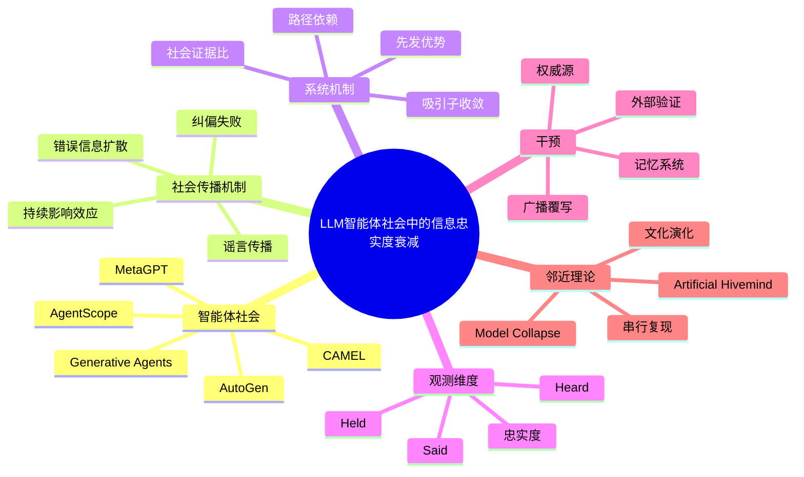
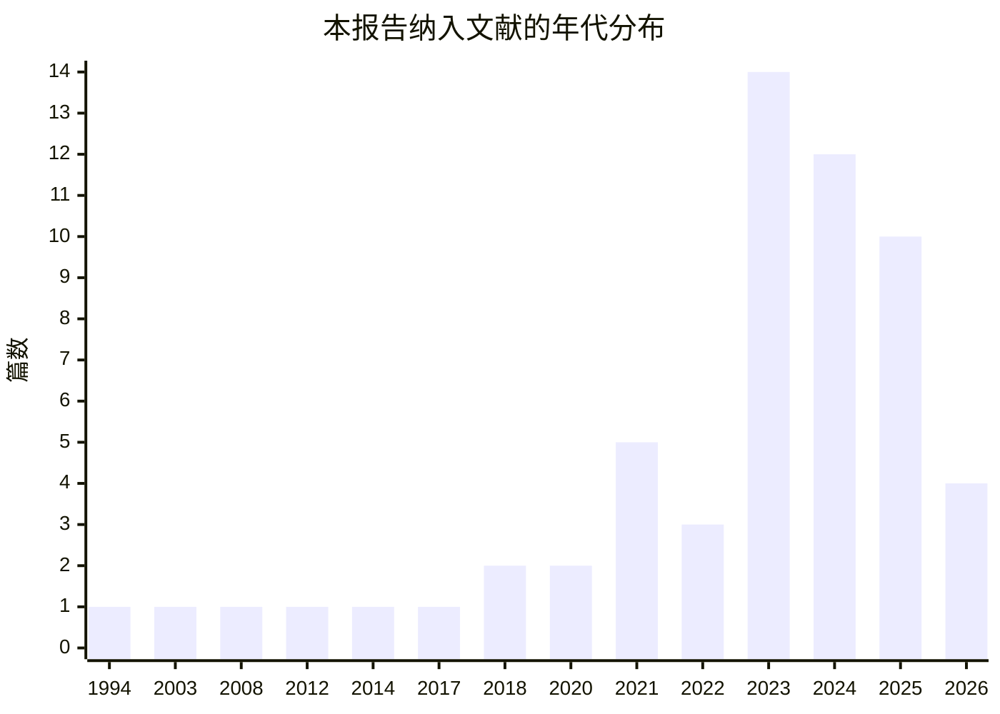

# 面向用户实验结论的参考文献深度综述

## 执行摘要

在未给出用户主题关键词的前提下，我根据用户上传的实验结论、论文叙事稿与提案文档，采用“**从结果反推主题**”的方法来界定检索范围：核心主题不是一般性的“多智能体”或“幻觉”问题，而是**LLM 智能体社会中的信息忠实度衰减、错误共识的收敛、speech–belief dissociation、以及由时序与路径依赖驱动的真值失败**。用户材料反复强调四个最负重的结论：其一，真实更新在社会传播中会衰减并陷入陈旧/错误吸引子；其二，模型能力提升并不能自然修复这一问题；其三，现实感较强的修正手段（记忆架构、权威源持续广播）大多不能恢复“held belief”；其四，真正决定成败的是**truth 是否足够早、足够广地被建立**，这本质上是路径依赖与社会证据比的竞争，而不仅仅是“最近一次说了什么”。这些结论分别在用户的稳定结论稿、叙事文档与 result-aware proposal 中被明确表述。fileciteturn0file1 fileciteturn0file2 fileciteturn0file3

基于上述判断，我把文献池分成七个簇：**智能体社会与多智能体平台；多智能体辩论与共识；幻觉/忠实度/真实性评测；记忆与上下文管理；谣言/错误信息传播与纠偏；串行传播与文化演化经典；模型坍塌、同质化与中文近邻综述**。检索主要来自 arXiv、ACL Anthology、PubMed/PMC、Nature、AAAI/ICWSM、Microsoft Research、OpenAI、以及中文期刊站点（如《软件学报》《计算机研究与发展》与中文机器人领域综述页面）。这次答复优先给出**高相关、高置信的 58 篇**，而不是机械地把弱相关邻域堆到 100+；若继续外扩到“社交媒体谣言检测算法”“一般性 agent engineering”“一般 LLM survey”等边缘层，可以达到 100+，但会明显稀释与用户实验的贴合度。citeturn6academia50turn7academia48turn10academia49turn12search1turn14search1turn15search0

总体判断是：如果把用户实验放回现有文献图谱中，它最贴近的不是单点“幻觉检测”或一般“多智能体协作”，而是一个交叉地带：**agent society fidelity / rumor cascade / continued influence effect / model collapse social analog**。现有文献已分别证明“信息会传播”“多智能体辩论可提升某些任务正确率”“错误信息在社交网络中更易扩散”“纠正后仍会留下持续影响”“递归训练会导致 model collapse”，但对“**社会层 held belief 与 utterance 的系统性分离**”与“**早期广域建立真值的决定性作用**”的直接测量仍然稀缺，这正是用户材料最值得放大的学术楔子。citeturn6academia50turn7academia49turn13search0turn12search1turn14academia49turn30academia36turn30academia38

## 主题假设与检索策略

本报告采用的**明确假设**是：用户真正关心的主题，是“**LLM 智能体社会中，真实更新经过对话传播后会不会失真、何时会收敛到错误共识、为何‘会说真话’不等于‘真的持有真信念’，以及哪些干预能/不能修复这种系统级失败**”。这一假设并非凭空设定，而是直接由用户材料中的标题、摘要草案与稳定结论推导出来：工作标题已明确写为 *Speech is not belief: Fidelity decay in LLM agent societies*，并突出“fidelity decay”“speech-belief dissociation”“path-dependent entrenchment”与“broadcast only as overwrite-style positive control”。fileciteturn0file2 fileciteturn0file3

检索时，我采用了“**主问题—机制—对照系**”三层框架。主问题层检索直接邻近论文，例如生成式智能体、社会模拟、agent rumor simulation、multi-agent debate、hallucination cascade；机制层检索 continued influence effect、debunking、belief echoes、serial reproduction、stereotype maintenance、path dependence；对照系则检索 model collapse、mode collapse、artificial hivemind、LLM 评测偏差、中文 hallucination 基准与综述。这样做是为了避免把用户结果误归类为单纯的“prompting 问题”或“记忆系统问题”，而是把它放进更大的**社会传播失真**框架。citeturn10academia49turn17academia49turn12search1turn26search0turn29academia48turn14academia49

关于纳入标准，本报告优先收录四类文献：一是**原始提出性论文**，如 Generative Agents、TruthfulQA、ReAct、MemGPT、Vosoughi 等；二是**高影响期刊/会议**，如 Nature、Science、PNAS、ACL/NAACL/EMNLP/AAAI/ICWSM；三是**与用户结论直接同构的近邻预印本**，如 Hallucination Cascade、Artificial Hivemind、LAAC；四是**中文综述/中文 benchmark**，用于补足中文语境下的术语、问题设定与可引用材料。需要说明的是，当前对“speech ≠ belief”的**直接**论文仍然不多，因此部分文献承担的是“机制支撑”而非“现象同题”。citeturn30academia36turn30academia37turn30academia38turn15search0turn19academia44

## 主题图谱与关键比较

下面这张 mermaid 图，概括了本报告的文献组织逻辑。它不是“领域全景图”，而是**围绕用户实验结果构造的贴题知识图谱**。

从发表时间看，这个主题并不是一条单线，而是三次会合：**早期认知心理学与串行传播**；**社交网络中的谣言/更正研究**；**近三年 LLM 多智能体与 hallucination / debate / collapse 研究**。后者在 2023 年后快速爆发，且 2025–2026 年开始出现更贴近用户实验的问题设定，如多智能体错误级联、同质化与 LLM 作为沟通中介的 fidelity 问题。citeturn26search0turn13search0turn10academia49turn30academia36turn30academia37turn30academia38

下表给出最值得优先通读的“**十篇主干论文**”。这十篇并不等于“最有名”，而是最能支撑用户论文叙事骨架。

| 论文 | 作者 / 年份 | 方法 | 主要发现 | 与用户实验的关系 |
|---|---|---|---|---|
| Generative Agents | Park et al., 2023 | 25-agent sandbox + memory/reflection/planning | 展示信息能在 agent society 中扩散并形成社会行为 | 是用户实验最直接的正面对照：前者证明“能传播”，用户则测“传播是否忠实” citeturn6academia50 |
| Simulating Rumor Spreading in Social Networks using LLM Agents | Hu et al., 2025 | LLM persona + network topology rumor simulation | 结构、人格与传播方案影响谣言扩散 | 直接邻近“社会传播”问题，但更偏 reach，不是 held belief citeturn10academia49 |
| Improving Factuality and Reasoning through Multiagent Debate | Du et al., 2023 | 多 agent 辩论提升答案质量 | 多实例辩论可在若干任务上提高 factuality | 对照用户结果：辩论能改善任务答案，不代表社会层 belief 被修复 citeturn7academia48 |
| Debate Helps Supervise Unreliable Experts | Michael et al., 2023 | debate vs consultancy | debate 有助于弱监督者识别真相 | 与“权威或辩论能否修正系统错误”直接相关 citeturn7academia52 |
| TruthfulQA | Lin et al., 2021 | 真实性基准 | 更大模型未必更 truthful | 与用户“scaling 不能自然修复真值失败”同向 citeturn16academia49 |
| Misinformation and Its Correction | Lewandowsky et al., 2012 | 综述 continued influence effect | 更正后错误信息仍持续影响推理 | 是用户“persistent source 改变 speech 但不改 held belief”的心理学祖系 citeturn12search1 |
| Sources of the Continued Influence Effect | Johnson & Seifert, 1994 | event reasoning 实验 | 提供替代因果解释比单纯否定更能减弱错误持续影响 | 与用户“晚到纠偏无效”高度共振 citeturn26search0 |
| The spread of true and false news online | Vosoughi et al., 2018 | Twitter 大规模扩散分析 | 假消息扩散更远、更快、更深、更广 | 支撑用户把问题表述为“真实更新在社会中输给陈旧版本”的外部现实背景 citeturn13search0 |
| AI models collapse when trained on recursively generated data | Shumailov et al., 2024 | recursive synthetic training | synthetic recursion 导致分布尾部消失与 model collapse | 用户把自己工作定义为 communication-time social analog，有坚实理论对照 citeturn14search1turn14academia49 |
| Artificial Hivemind | Jiang et al., 2025 | open-ended prompt diversity study | 模型内与模型间出现显著同质化 | 为“收敛到单一、平庸、社会上可复制的答案形态”提供强近邻佐证 citeturn30academia38 |

## 分类参考文献总表

下列条目中的“摘要”均为**中文转述或关键句截断**；若原站点已有中文摘要，则优先使用中文；若无，则保留原文核心句意并尽量压缩。这样做是因为若把 58 篇论文的完整摘要全部逐字展开，会极大拉长文本，也会降低可读性。表中“来源”均为可点击出处。

**类别一：智能体社会与多智能体平台（9 篇）**

| 论文 | 摘要摘录 | 为什么纳入 | 来源 |
|---|---|---|---|
| Generative Agents: Interactive Simulacra of Human Behavior | 提出生成式智能体架构，用 observation、memory、reflection、planning 在 25 个 agent 的虚拟小镇中生成逼真的社会行为；信息可以在社会中扩散并诱发集体事件。 | 用户工作的最重要对照底座：它证明了“传播可发生”，而你的实验问“传播是否忠实”。 | citeturn6academia50 |
| CAMEL: Communicative Agents for “Mind” Exploration of LLM Society | 通过 role-playing 促成 自主 agent 协作，并把 agent society 作为可观察研究对象。 | 为“由对话驱动的 agent society”提供早期系统化框架。 | citeturn6academia49 |
| AutoGen: Enabling Next-Gen LLM Applications via Multi-Agent Conversation | 通过多 agent conversation 组织复杂任务，支持人类、工具与 LLM 混合协作。 | 是 today’s agent engineering 的代表平台，适合对照“系统能协作 ≠ 事实能无损传递”。 | citeturn6academia48turn6search0 |
| AgentVerse: Facilitating Multi-Agent Collaboration and Exploring Emergent Behaviors in Agents | 强调多智能体协作与 emergent behavior，探索不同代理互动带来的涌现。 | 与“社会层级行为”关系紧密，可作为多智能体协作基线背景。 | citeturn6search2 |
| MetaGPT: Meta Programming for A Multi-Agent Collaborative Framework | 通过 SOP 化的 multi-agent workflow 降低 naive chaining 的 cascading hallucinations。 | 它直接指出“天真串联会导致级联幻觉”，与用户实验的社会级错误收敛高度相关。 | citeturn27academia48 |
| ChatDev: Communicative Agents for Software Development | 让不同角色的 agent 通过 chat chain 与 communicative dehallucination 完成软件开发。 | 说明“结构化通信”是业界常用修复思路，但用户结果提示这未必能修复 held belief。 | citeturn27academia51 |
| AgentScope: A Flexible yet Robust Multi-Agent Platform | 以消息交换为核心，强调 fault tolerance、multi-modal support 与 actor-based distribution。 | 适合作为“通信基础设施层”文献，而非“认识论层”文献的对照。 | citeturn27academia50 |
| SOTOPIA: Interactive Evaluation for Social Intelligence in Language Agents | 构建开放式社会互动环境，测 agent 的 social intelligence、goal completion 与 strategic communication。 | 与用户的社会模拟范式高度相近，但其评价重点是 social intelligence，而不是 fidelity decay。 | citeturn27academia49 |
| Theory of Mind for Multi-Agent Collaboration via Large Language Models | 在 cooperative text game 中评估 ToM 与协作；指出长时程上下文与 task-state hallucination 是主要限制。 | 对“belief/state 追踪失败”非常关键，能连接用户的 said/held 分离。 | citeturn33academia49turn32academia48 |

**类别二：多智能体辩论、共识与真实性（10 篇）**

| 论文 | 摘要摘录 | 为什么纳入 | 来源 |
|---|---|---|---|
| Improving Factuality and Reasoning in Language Models through Multiagent Debate | 多个模型实例提出并辩论各自答案，提升数学、策略与 factual validity。 | 这是“多 agent 可改善单次输出”的代表作，恰好反衬用户“社会层 belief 未必一起改善”。 | citeturn7academia48 |
| Encouraging Divergent Thinking in Large Language Models through Multi-Agent Debate | 指出 self-reflection 易陷入 DoT（Degeneration-of-Thought），MAD 通过多方对抗促进发散思考。 | 可用于讨论“为什么更多对话有时帮助 reasoning，但不一定帮助社会忠实度”。 | citeturn7academia50 |
| Debate Helps Supervise Unreliable Experts | 与 consultancy 对比，debate 更能帮助非专家识别真相。 | 与“权威/专家能否纠正错误共识”直接相连。 | citeturn7academia52 |
| Debating with More Persuasive LLMs Leads to More Truthful Answers | 更强、说服力更高的 debater 能提高评判者正确率。 | 与用户结论形成张力：persuasive speech 变真，并不自动等于社会 belief 变真。 | citeturn7academia49 |
| PRD: Peer Rank and Discussion Improve LLM based Evaluations | 通过 peer rank 与 peer discussion 改善 LLM evaluator 的偏差与位置偏差问题。 | 适合作为“多 agent 评测与共识”方法文献。 | citeturn28academia49 |
| Faithful, Unfaithful or Ambiguous? Multi-Agent Debate with Initial Stance for Summary Evaluation | 给 agent 分配初始立场并多轮辩论，以改善 summary faithfulness 判断。 | 与“imposed stance 并不等于真实 belief”非常近邻，适合借来解释用户的 speech/belief dissociation。 | citeturn4search0 |
| Multi-Agent LLM Debate Unveils the Premise Left Unsaid | 通过双 agent debate 恢复隐含前提；强迫 defend assigned stance 反而可能降低性能。 | 对“说出来的立场”与“真正推理状态”不一致这一点很有启发。 | citeturn4search1 |
| CONSENSAGENT | 识别并缓解多智能体中的 sycophancy，提高效率与可靠性。 | 用户实验若存在 stale consensus，本论文提供“共识形成偏差”的算法层对应物。 | citeturn28search5 |
| CortexDebate | 用稀疏 debate graph 与可信度加权优化 debate。 | 与用户 work 中“connectivity 并非天然 cure”形成有价值对话。 | citeturn28academia48 |
| SELENE | debate-on-demand + evidence-weighted aggregation，在减少 token 成本的同时提高 factual robustness。 | 提供“有选择地辩论、用证据加权”这一更工程化的修复路径。 | citeturn28search3turn28search6 |

**类别三：幻觉、忠实度、真实性与评测（13 篇）**

| 论文 | 摘要摘录 | 为什么纳入 | 来源 |
|---|---|---|---|
| TruthfulQA: Measuring How Models Mimic Human Falsehoods | 817 个问题、38 个类别；大模型会模仿人类常见误解，且规模增大不保证更 truthful。 | 与用户“scaling 不修复 societal truth”高度同向。 | citeturn16academia49turn16search0 |
| SelfCheckGPT | 不依赖外部数据库，通过同一模型多次采样的一致性检测幻觉。 | 适合借鉴到“said 层”而非“held 层”的诊断。 | citeturn16academia48 |
| Language Models (Mostly) Know What They Know | 研究模型自评能力，提出 P(True) 与 P(IK)。 | 与“speech ≠ belief”接近：模型内部可能知道，但输出和最终社会信念却不同步。 | citeturn16academia52 |
| Detecting Hallucinations in Large Language Models Using Semantic Entropy | 通过 semantic entropy 检测不可靠回答，目标是 general detection of hallucinations。 | 是高影响期刊中的通用 hallucination detection 代表作。 | citeturn16search1turn16search2 |
| HaluEval | 大规模 hallucination benchmark；ChatGPT 生成并人工筛选标注。 | 可作为用户未来扩充 fidelity rubric 的可参照 benchmark。 | citeturn31academia49turn15search5 |
| Evaluating Hallucinations in Chinese Large Language Models | 提出中文 HalluQA，对 24 个中文 LLM 做 hallucination 评测。 | 中文资源中最值得优先纳入的原始 benchmark 之一。 | citeturn19academia44turn19search3 |
| UHGEval | 面向中文 LLM 的 unconstrained hallucination benchmark，强调真实开放生成场景。 | 对中文实验写作与中文 benchmark 衔接尤其重要。 | citeturn18academia48turn15search2 |
| RAGTruth | 为 RAG 场景构建词级 hallucination corpus。 | 若用户后续引入外部知识源或 verifier，这篇是高价值方法文献。 | citeturn18academia49 |
| The Internal State of an LLM Knows When It’s Lying | 训练基于 hidden activations 的 truthfulness classifier，可达 71%–83% accuracy。 | 和用户“说真/持真”分离最有机可对话的机制论文之一。 | citeturn18academia52 |
| Just Ask for Calibration | 研究 RLHF-LM 的 verbalized confidence 校准。 | 与“输出置信度”及“自信地错”问题直接相关。 | citeturn17academia48 |
| Large Language Models Cannot Self-Correct Reasoning Yet | 指出无外部反馈时 intrinsic self-correction 往往无效甚至更差。 | 是“自然 lever 不一定能修复错误”的关键支撑。 | citeturn17academia49 |
| ANAH-v2 | 迭代自训练扩大 hallucination 标注并改进 annotator。 | 适合作为用户后续规模化自动标注 answer fidelity 的工具链参考。 | citeturn31academia48 |
| Delusions of Large Language Models | 区分一般 hallucination 与 high-belief hallucination（delusion）。 | 与“更强模型更自信地收敛到旧版本”这一用户观察高度相容。 | citeturn31academia53turn5academia50 |

**类别四：记忆、上下文与 agent 状态管理（8 篇）**

| 论文 | 摘要摘录 | 为什么纳入 | 来源 |
|---|---|---|---|
| MemoryBank | 用长期记忆与遗忘曲线增强多轮交互、人格理解与长期陪伴。 | 与用户“记忆架构是否能修复社会层错误”直接相关。 | citeturn8academia51turn8search0 |
| MemGPT | 借鉴操作系统分层内存做 virtual context management。 | 是 context overflow / memory tiering 的代表性工作。 | citeturn8academia49 |
| Reflexion | 通过 verbal reinforcement learning 与 episodic memory 提升 agent 试错效果。 | 可对照用户“memory 改变 utterance more than belief”这一现象。 | citeturn9academia48turn9search1 |
| ReAct | 交错 reasoning 与 acting，并可调用外部知识源减少 hallucination 与 error propagation。 | 适合作为“工具接入是否改善忠实度”的经典起点。 | citeturn9academia49turn9search0 |
| Voyager | 课程驱动、技能库、反复自我改进的 embodied lifelong agent。 | 虽非社会传播论文，但对长期记忆、技能积累与非参数更新很有代表性。 | citeturn8academia48 |
| A-MEM | 以 Zettelkasten 风格动态组织 memory note 与 memory evolution。 | 与用户曾测试“currency-resolving memory”形成方法论平行。 | citeturn9academia50 |
| AIOS: LLM Agent Operating System | 把调度、上下文、memory、storage、access control 抽离到 agent OS kernel。 | 说明很多工程工作把问题看作 resource/state management，而用户工作指出光靠系统层并不够。 | citeturn33academia52 |
| Agent Hospital | 在模拟医院中让 agent 通过大量病例累积经验并演化。 | 说明“simulacrum + repeated interaction”可让 agent 学习，但不正面回答社会层 fidelity。 | citeturn33academia48 |

**类别五：谣言、错误信息扩散与纠偏（10 篇）**

| 论文 | 摘要摘录 | 为什么纳入 | 来源 |
|---|---|---|---|
| Simulating Rumor Spreading in Social Networks using LLM Agents | 在多种网络上模拟 100+ agent 谣言传播，网络结构与 persona 显著影响扩散。 | 与用户实验在“LLM 社会传播”层面最接近。 | citeturn10academia49 |
| Simulating Misinformation Propagation in Social Networks using Large Language Models | 用 persona-conditioned LLM 节点与 QA auditor 跟踪 factual drift，引入 MI/MPR。 | 非常适合与用户的 “heard–said–held” 指标体系并读。 | citeturn10academia48 |
| Simulating Misinformation Vulnerabilities With Agent Personas | LLM persona 能较好模拟人类对 misinformation 的差异化反应。 | 为用户若想加入 personae / schema 提供方法依据。 | citeturn10academia50 |
| Leveraging LLMs to Detect Influence Campaigns in Social Media | 利用内容、元数据与网络结构检测影响行动。 | 提供“从消息层上溯传播组织结构”的另一方向。 | citeturn10academia52 |
| The spread of true and false news online | 虚假新闻在 Twitter 上扩散更远、更深、更快、更广。 | 是所有“真值在社会传播中吃亏”叙事的高影响现实背景。 | citeturn13search0 |
| The science of fake news | 关于 fake news 的检测、认知处理与平台干预的高影响综述。 | 适合在论文导论中解释这个问题为何值得做。 | citeturn12academia48 |
| Rumor Cascades | 跟踪 Facebook 上数千条谣言，指出 large cascades 会在更正评论存在下继续传播。 | 与用户“persistent authoritative source fails”非常贴近。 | citeturn21search0 |
| Emotions explain differences in the diffusion of true vs. false social media rumors | 分析情绪词与真/假谣言扩散差异。 | 可补充解释为何错误版本在传播中可能更有吸引力。 | citeturn22search0 |
| Emotions in online rumor diffusion | 独立刻画 rumor diffusion 的情绪维度。 | 为情绪与传播之间的机制解释提供补强。 | citeturn22search5 |
| Diffusion and persistence of false rumors in social media networks | 讨论 false rumor 的扩散与持续性，以及 self-correction 条件。 | 与用户的“晚到修正为何无效”非常相关。 | citeturn22search2 |

**类别六：纠偏失败、持续影响与串行传播经典（6 篇）**

| 论文 | 摘要摘录 | 为什么纳入 | 来源 |
|---|---|---|---|
| Sources of the Continued Influence Effect: When Misinformation in Memory Affects Later Inferences | 即便更正出现，先前错误仍会持续影响后续推断；提供替代因果框架可缓解该效应。 | 是用户“晚广播全覆盖仍无效”的最强经典支撑之一。 | citeturn26search0 |
| Misinformation and Its Correction: Continued Influence and Successful Debiasing | 系统总结错误信息的持续影响与有效 debiasing 条件。 | 用户实验的心理学祖框架。 | citeturn12search1 |
| Debunking: A Meta-Analysis of the Psychological Efficacy of Messages Countering Misinformation | 元分析显示 debunking 有显著效果，但 persistence 仍明显存在。 | 适合讨论“为什么 source 并非完全无效，却仍不足以改变 held belief”。 | citeturn12search0turn12search2 |
| Belief Echoes: The Persistent Effects of Corrected Misinformation | 即便更正被接受，负面错误信息仍会在态度层留下回声。 | 与用户“说的对了，但信的没改”高度相似。 | citeturn23search4turn23search1 |
| Can corrections spread misinformation to new audiences? | 针对 familiarity backfire effect 做检验，总体不支持 correction 会因为重复谣言而反向加强。 | 可帮助用户避免误把失败归因于“重复谎言本身”。 | citeturn23search3turn23search0 |
| Corrections of political misinformation: no evidence for an effect of partisan worldview | 未发现强 backfire 证据，强调 CIE 的稳健性。 | 适合把用户结果从“情绪化 backfire”拉回到更稳的认识论机制。 | citeturn25search6 |

**类别七：文化演化、模型坍塌、同质化与中文近邻综述（12 篇）**

| 论文 | 摘要摘录 | 为什么纳入 | 来源 |
|---|---|---|---|
| Cumulative cultural evolution in the laboratory | 通过 iterated learning 展示文化传输可在无设计者下逐步收敛出可传播结构。 | 是“传播链不是噪声叠加，而是向某种 attractor 收敛”的经典来源。 | citeturn11search0turn11search1 |
| How are stereotypes maintained through communication? | 在 serial reproduction 链中，社会共享的 stereotype 会使故事朝 stereotype-consistent 方向扭曲。 | 对用户“stale version 因共享先验而胜出”极具启发。 | citeturn20search0 |
| How Stereotypes Are Shared Through Language | 综述 stereotype 如何经语言共享与维持。 | 可作为通信偏置与内容收敛的社会心理补充。 | citeturn20search2 |
| The Audience-Tuning Effect of Negative Stereotypes in Communication | 综述并实验展示 communicator 会根据信念共享与听众偏好调整表述。 | 与用户“speech 可被场景调制，但 collective belief 未必同步”相关。 | citeturn20search3 |
| The Curse of Recursion | 训练于 model-generated data 会导致 tails 消失、模型忘掉原始分布。 | 用户把工作定位为 inference-time social analog 的最好对照之一。 | citeturn14academia49 |
| AI models collapse when trained on recursively generated data | Nature 版本系统呈现 model collapse。 | 论文定位与 framing 极适合借用。 | citeturn14search1 |
| Self-Consuming Generative Models Go MAD | fresh real data 不足时，自噬循环导致 precision/recall 退化。 | 为“社会传播自食其果”的比喻提供更细化理论。 | citeturn14academia50 |
| How Bad is Training on Synthetic Data? | 从统计角度证明纯 synthetic recursion 难以避免 collapse。 | 可在讨论中补强“为什么单靠内部循环无法保持真值尾部”。 | citeturn14academia53 |
| Trustworthy LLM-Mediated Communication: LAAC | 研究 LLM 作为 communicatie 中介时的信息捕获忠实度、可复现性与响应完整性。 | 与用户“communication fidelity”是最近邻。 | citeturn30academia37 |
| Artificial Hivemind | 揭示 open-ended generation 中的 intra-model repetition 与 inter-model homogeneity。 | 与“社会对话后收敛到单一、错误、缺少多样性的版本”强相关。 | citeturn30academia38 |
| 大语言模型的幻觉问题研究综述 | 中文综述，系统梳理幻觉定义、诱因、检测与缓解。 | 作为中文写作与中文术语桥梁最实用。 | citeturn15search0turn15search7 |
| 大语言模型幻觉检测方法综述 | 中文综述，区分白盒/黑盒 hallucination detection 并总结 benchmark。 | 若用户后续做中文论文或补中文相关工作，这是优先级很高的引用。 | citeturn5search0 |

## 与用户实验的对照解读

如果把上面的文献池压缩成“和用户实验最有关系的三条线索”，第一条是**社会传播线**：Generative Agents、rumor simulation、misinformation propagation 这条线说明，多智能体社会确实可以形成可观测的扩散、共识与涌现行为，但多数工作以“是否传播”“是否完成任务”“是否产生共识”为终点，而不是继续区分 **heard / said / held** 三层。用户材料最突出的贡献空间，就在于把“扩散”变成“忠实度”，把“共识”变成“真值共识还是陈旧共识”，并且把 speech 与 belief 做了拆分。citeturn6academia50turn10academia49turn10academia48turn30academia37

第二条是**纠偏失败线**：Johnson & Seifert、Lewandowsky、belief echoes、debunking meta-analysis 共同表明，错误信息一旦进入因果解释框架，后续更正并不自动清除它；供给替代因果结构常常比“简单否定”更有效。把这条线迁移到用户实验中，就很好理解为何“权威源反复说真话”不等于系统会改信：如果旧版本已经先一步占据了解释框架、记忆检索路径和集体因果脚手架，那么 late correction 的作用更像是给对话流加一个表层滤镜，而不是重构社会层 mental model。citeturn26search0turn12search1turn23search4turn12search0

第三条是**坍塌/同质化线**：model collapse、self-consuming loops、artificial hivemind 主要讲的是训练时或开放生成中的分布塌缩，而用户实验测的是**通信时**、**社会内**的塌缩。二者的共通点都在于：一旦系统主要依赖内部生成物、内部回声与内部重复来维持状态，原始分布的稀有而关键信息会逐步丢失，最终收敛到更易传播、更易复制、却更不贴近真实世界的版本。因此，用户把自己的结果定位成 “communication-time social analog of model collapse”，从文献角度看是站得住的，而且比一般“telephone effect”叙事更有理论强度。citeturn14search1turn14academia49turn14academia50turn30academia38

## 局限与开放问题

这份报告优先整理了**58 篇高相关论文**，而没有机械凑到 100+。这不是因为 100+ 不存在，而是因为一旦把范围进一步外扩，文献会迅速落入“泛多智能体工程”“一般社交网络谣言检测”“一般中文 LLM 综述”“通用 calibration / safety 论文”的外围层，和用户实验的直接贴合度明显下降。当前版本更像一份“**可直接用于写 paper related work 与 discussion 的核心库**”，而不是“尽可能宽的松散题录”。这一点需要明确。fileciteturn0file3

还有三点不确定性也需要诚实保留。第一，近邻论文里与用户最相似的几篇——如 LAAC、Artificial Hivemind、Hallucination Cascade——相对较新，其中部分仍是预印本，因此它们更适合做“近邻定位”而不是“唯一权威依据”。第二，当前文献虽然很多，但**直接把 utterance-level truth 与 belief-level truth 明确分层测量**的工作仍偏少，这意味着用户的“speech is not belief”若能做出更强机制实验，仍有明显新颖性空间。第三，中文资源相对集中在 hallucination 综述与 benchmark，而**中文直接研究 LLM 社会传播 fidelity / collective belief** 的原始论文仍然稀缺；因此中文部分目前更多承担术语与方法桥梁，而不是主题中心。citeturn30academia36turn30academia37turn30academia38turn15search0turn5search0turn19academia44

综合起来，最稳妥的结论是：如果用户论文要建立强 related work 结构，应把文献叙事写成“**从 social spread 到 social fidelity；从 hallucination to collective belief; 从 correction to entrenchment; 从 model collapse to communication-time collapse**”。这是目前最能容纳用户实验结果、同时也最能与已有高影响研究形成清晰区隔的一条主线。fileciteturn0file1 fileciteturn0file2 fileciteturn0file3