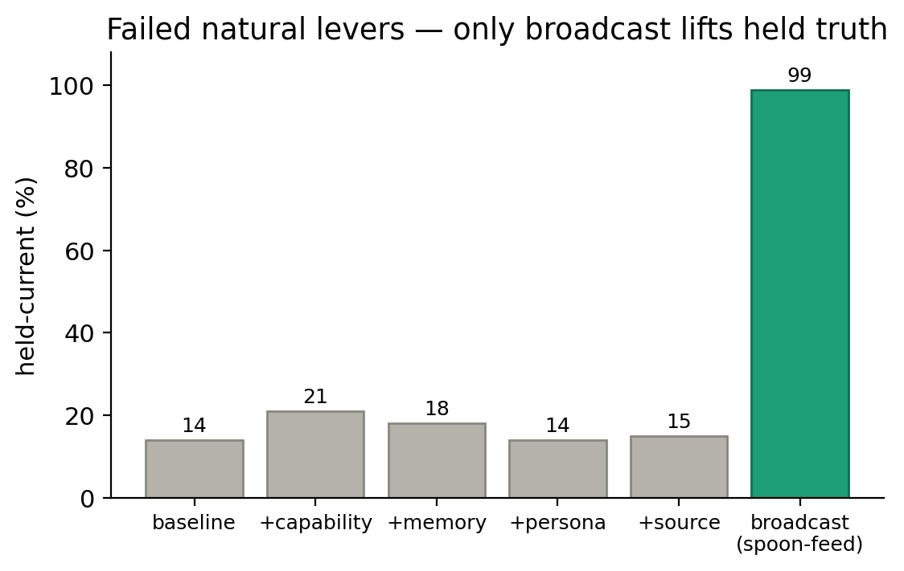
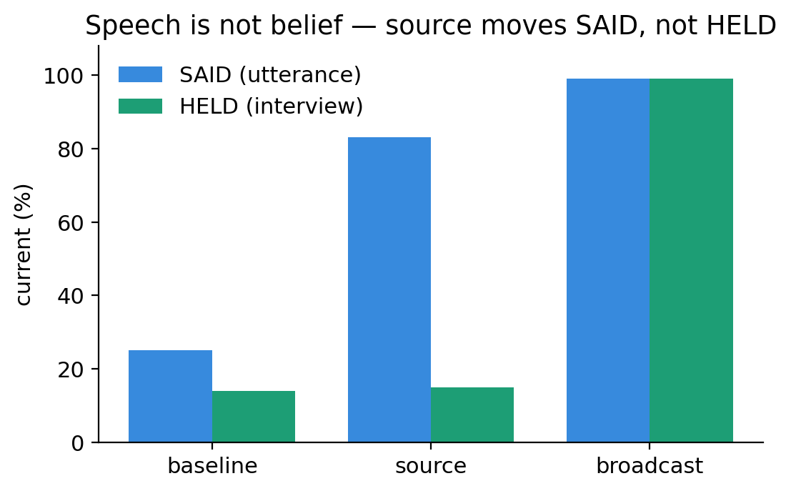
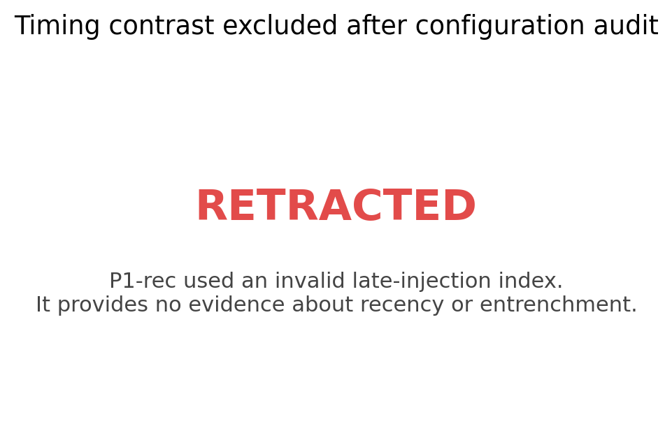
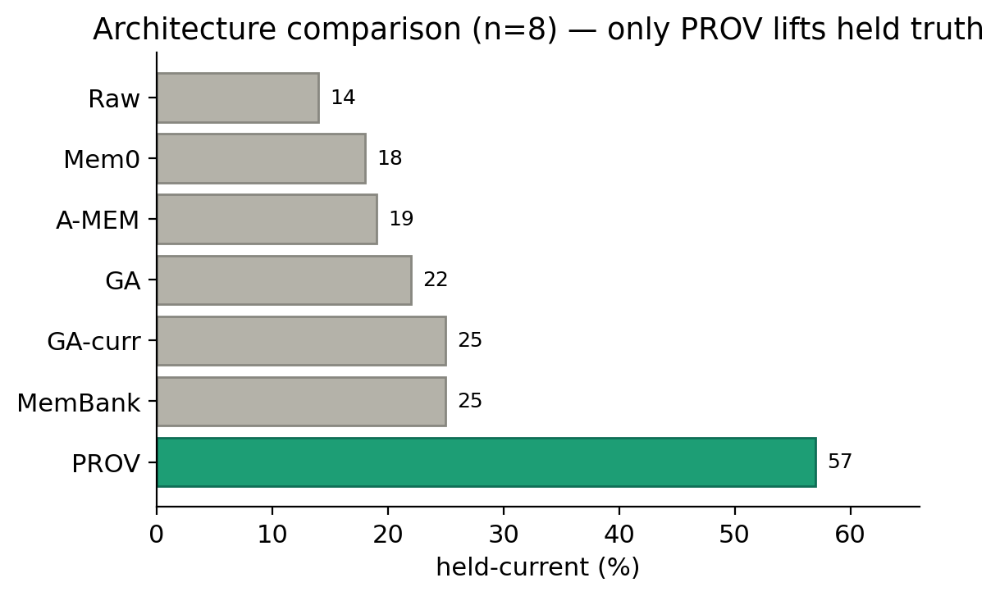
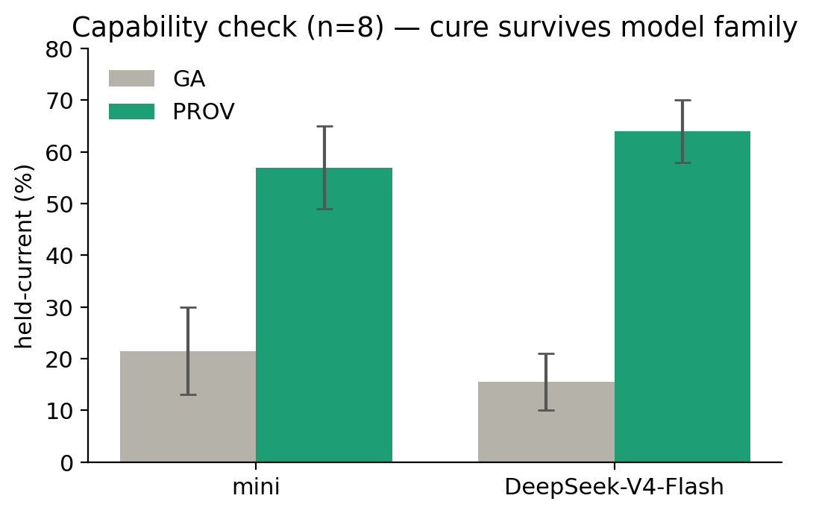
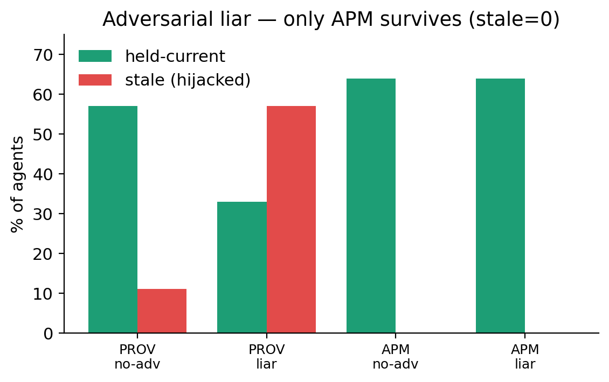
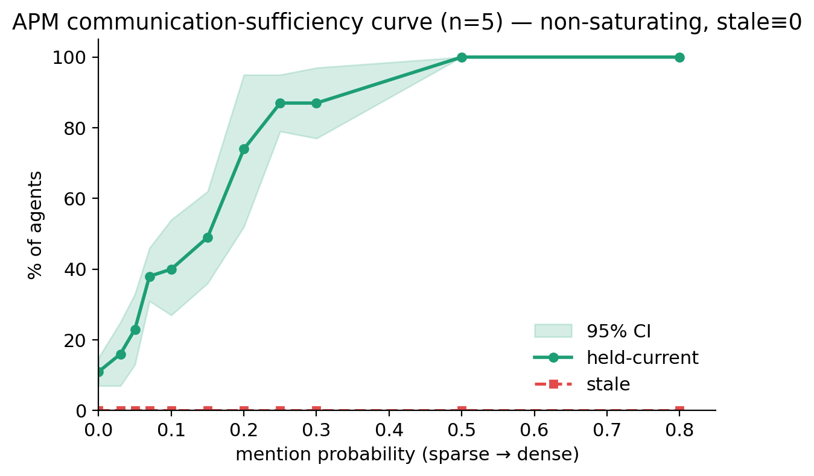

# When Truth Loses Its Source: Provenance-Aware Memory for Socially Distributed Agents

> **SUPERSEDED (2026-07-06):** replaced by `draft_v2.md` (post-audit surgery: §4.3/Fig 3 excised,
> reframed off the provenance headline, related work rebuilt on first-hand-verified neighbors).
> Kept as archive; do not edit.

> **Audit warning (2026-06-30):** P1-rec's late-broadcast condition contained zero injections.
> Section 4.3's entrenchment-vs-recency claim is invalid and must not be submitted. See
> `../docs/project/p1_rec_audit_2026-06-30.md`.

> Draft v1 (2026-06-26; language pass). Assembled from `narrative.md`, `introduction.md`,
> `measurement_grounding.md`, `sections/discussion.md`, and the `figure_guide.md` /
> `RESULTS.md` data. Figures are in `figures/`; numbers trace to the RESULTS.md ledger.
> Anonymized AAAI-style draft. Citations are placeholder `(Author Year)` / bib keys.

## Abstract

LLM agents increasingly coordinate by talking to one another, and a growing body of work shows
that information *spreads* through agent societies. We ask a reliability question that spread does
not answer: when a ground-truthed fact changes, does the society come to **hold** the new truth,
or merely **say** it? With a social-fidelity probe that separately measures what agents hear, say,
and later hold, we find a robust **speech–belief dissociation**: an authoritative source drives
agents to utter the current value while their held belief stays at baseline. No natural lever
fixes this — not model capability, connectivity, memory swaps, richer personas, or a persistent
source; only direct broadcast, an overwrite control, succeeds. The mechanism is **path-dependent
entrenchment**: the version established early and broadly wins. We then localize the repair to a
single architectural choice — integrating heard claims by **provenance** (source and version)
rather than by frequency. Provenance-aware memory (PROV) is the only memory architecture that
lifts held truth, and it holds across scenarios, fact types, topologies, and model families
(gpt-5.4-mini and DeepSeek-V4-Flash, n=8). Hardened into an **auditable architecture (APM)** with
origin anchoring, corroboration, and abstain, it remains the only architecture that survives an
adversarial liar (zero hijack, against PROV's collapse) and settles to a realistic, non-saturating
equilibrium under sparse communication — never confidently wrong.

---

## 1. Introduction

A true update can become unreliable without ever becoming intentionally false. In human societies
a message may be accurate when first announced, but after a few retellings people keep the content
while losing track of who said it, when it was updated, and whether it superseded an older version.
This is the telephone-game failure: the social channel does not merely transmit content, it also
drops source, timing, and authority cues.

LLM-agent societies reproduce this failure in an instrumented setting. Unlike a human rumor chain,
an agent society exposes every utterance, every injected update, every memory snapshot, and every
final answer — letting us separate three objects that are usually conflated:

- **Reach** — whether the current update appears in the social transcript;
- **Speech** — whether agents later utter the current value;
- **Held answer** — whether agents answer with the current value when probed after transmission.

Generative-agent work establishes that information can spread through an agent society
(Park et al. 2023; Li et al. 2023; Wu et al. 2023; Zhou et al. 2024). Spread, however, is not
fidelity. A correction, schedule change, or policy update can reach the conversation stream yet
fail to become the society's later answer. Our central finding is that reach and speech improve
**without** durable held truth — so "information spread" is not a sufficient evaluation target for
agent societies.

We make three contributions. **(1) A measurement shift:** a social-fidelity probe that separates
heard, said, and held. **(2) A diagnosis:** a speech–belief dissociation driven by path-dependent
entrenchment, which no natural lever repairs. **(3) A cure and an architecture:** integrating by
provenance rather than frequency is the lever that works, and hardened as APM it is the only memory
architecture that stays interpretable, survives an adversarial liar, and yields a realistic
non-saturating equilibrium.

Our working hypothesis is that *truth decays not merely because content changes, but because content
loses its source.* Stripped of source and version, "Saturday at the porch" and "Sunday at the
community center" compete as undifferentiated text, and the old value can win simply because it was
established early, repeated often, or retrieved more easily. Provenance changes the social state
representation: an agent can ask not only "what have I heard?" but "who said it, is it the latest
authoritative version, and does it supersede the old one?"

---

## 2. Related work

**Agent societies and communicative agents.** Generative Agents (Park et al. 2023), CAMEL
(Li et al. 2023), AutoGen (Wu et al. 2023), and SOTOPIA (Zhou et al. 2024) establish the setting:
agents talk, remember, coordinate, and simulate social environments. We pose a missing reliability
question within it — the fidelity of a *changing* held fact.

**Misinformation, rumor, reach vs fidelity.** Rumor and continued-influence research separates
spread from truth and shows that corrections often fail to displace stale beliefs
(Lewandowsky et al. 2012; Thorson 2016). LLM-agent rumor simulations are close neighbors, but they
typically measure propagation or vulnerability; we measure held-fact fidelity after a truth change.
The closest concurrent neighbor (*From Spark to Fire*, Xie et al. 2026) also studies
provenance-style cures and adoption-vs-repetition; we lead instead on the explicit, separately
elicited SAY/HOLD dissociation, a head-to-head decentralized-memory comparison, and adversarial
robustness.

**Factuality and measurement.** Treating truthfulness as a semantic behavioral target rather than
surface fluency is now standard (TruthfulQA, Lin et al. 2022; SelfCheckGPT, Manakul et al. 2023;
semantic entropy, Farquhar et al. 2024). Our three-way verdict mirrors fact verification (FEVER,
Thorne et al. 2018) and the efficacy-vs-locality structure of knowledge editing (ROME,
Meng et al. 2022; MEMIT, Meng et al. 2023).

**Memory, correction, recursive degradation.** Memory systems (Mem0, Chhikara et al. 2025; A-MEM,
Xu et al. 2025; MemoryBank, Zhong et al. 2024) explain why exposure is not retention;
belief revision and truth maintenance (AGM, Alchourrón et al. 1985; Doyle 1979) and
source-credibility opinion dynamics (DeGroot 1974) motivate provenance; and model-collapse work
(Shumailov et al. 2023) offers an analogy for recursive degradation — though ours is
communication-time degradation, not training-time collapse.

---

## 3. Method: the social-fidelity probe

**Setup.** A society of 25 LLM agents on a contact graph organizes an event. At round 1 the event's
time and place **change** from a stale value (A) to a current value (B), and the update is injected
into a single source agent. Agents then meet pairwise over rounds (a `meetings` parameter sets how
many encounters each agent has per round, i.e. connectivity), converse, store what they hear, and
retrieve memory to condition later utterances. We log every utterance (SAID) and, at the end,
privately interview every agent about the current fact (HELD): Inject → Propagate → Measure.

**The current / stale / unknown verdict.** Because the fact's truth value changed, we classify each
held answer three ways, mirroring recognized evaluation structures: **current** (holds the new
value — edit *efficacy* / SUPPORTED), **stale** (holds the superseded value — a *locality* failure /
continued-influence), and **unknown** (holds neither — a retention failure / NOT-ENOUGH-INFO).
The three-way split is load-bearing: separating *stale* (active corruption) from *unknown*
(information loss) is essential, because interventions act on them differently — scaling capability,
for instance, converts loss into confident corruption (§4.1). A semantic LLM judge reproduces the
keyword verdict (99–100% agreement), so the categories are not a keyword artifact.

**HEARD / SAID / HELD.** The probe's leverage comes from separating what reaches an agent, what it
utters, and what it later holds. "Held belief" is operational — the answer an agent gives when
probed; we make no claim about literal mental states.

---

## 4. Results

### 4.1 Social fidelity decays, and no natural lever repairs it

In the core task the current value reaches the conversation stream but does not reliably become the
society's held answer. Over a long horizon (M5) the dynamics are sharper still: current truth can
rise early, peak near round 6, then decay toward a low steady state by round 30 — so truth can
appear transiently and still lose, and the round-5 snapshot slightly overstates retention.

Figure 1 and Table 1 rule out every intuitive repair. Capability (16→21% across
mini→gpt-5.4→gpt-5.5), connectivity (roughly neutral in the powered rerun — the early
"connectivity amplifies corruption" cell was an underpowered outlier, now retracted), a memory swap
(the apparent smga3g rescue did not replicate), thick Park-style personas, and a persistent
authoritative source all leave held truth at the ~14–21% baseline. Only broadcasting the current
value into **every** agent succeeds (99%) — an overwrite-style positive control that bypasses social
transmission, not a social cure. Agents can clearly output the truth; the problem is that ordinary
social communication does not reliably install it as held belief.

*Table 1 — failed-lever evidence ledger.* capability mini→gpt-5.5: 16→21% (ns); connectivity:
ratio ~0.8–1.1 (neutral); memory GA vs smga3g: Δ≈0 (ns); persona thin vs thick: 12 vs 14% (ns);
source: Δ+0.8 (ns); broadcast: +21.8 (sig) → 99%.

### 4.2 Speech is not belief

Figure 2 is the centerpiece. Separating SAID (final-round utterances) from HELD (private interviews)
exposes a dissociation: under a persistent authoritative source, agents reach 83% current in what
they **say** while their **held** belief stays near baseline (15%). The gap is not confined to the
source condition — even baseline agents say the current value more than they hold it (SAID 56% /
HELD 12%) — and only broadcast aligns the two (99/99). Reach is not belief: a fact can be visible in
the transcript while failing as held state.

*Table 2 — HEARD→SAID→HELD (final-round SAID; HELD at interview).* baseline said 56 / held 12;
source said 83 / held 15 (the gap); broadcast said 99 / held 99. The source row's high-SAID,
low-HELD is the dissociation, and even baseline says more than it holds. The pattern replicates
across three scenarios (G1) and survives thick personas (G2).

### 4.3 The mechanism is entrenchment, not recency

Two stories could explain a sticky stale belief. If *recency* drove belief, a late all-agent
broadcast just before the probe should work; if *repetition* drove it, a single early all-agent
broadcast should fail. The opposite happens (Figure 3): an early (round-1) all-agent correction
succeeds (100%), while an identical late (round-5) one fails (0%). What governs the outcome is
whether the truth becomes the early, broad version that later conversation reinforces. The stale
value starts with incumbent advantage, so a narrow or late correction can be uttered without ever
taking over the society's held state. We call this **path-dependent entrenchment**.

### 4.4 The cure: integrate by provenance, not frequency

The diagnosis points to a precise repair. Decay arises because integration is by frequency, so the
stale incumbent wins; we integrate by **provenance** instead. Each claim carries a version (its
origin round) as conversation metadata; an agent holds the highest version it has *heard* and
re-broadcasts that versioned belief, so the latest authoritative version supersedes the merely
frequent older one. This is **fair**, not broadcast in disguise: PROV never overwrites an agent —
the current value must still arrive through conversation, and an agent that never hears it stays
stale or unknown. PROV changes only how an agent integrates and relays what it locally hears. It is
also principled: it directly negates the diagnosed mechanism, it is normatively correct for a
changing fact (frequency is the wrong cue — an old value repeated often is still old), and it
instantiates classic ideas — truth maintenance and belief revision (Doyle 1979; AGM) and
source-weighted opinion dynamics (DeGroot 1974) — in the social channel.

Figure 4 places PROV beside recognized memory architectures under one harness. Raw (14), Mem0 (18),
A-MEM (19), GA (22), GA-curr (25), and MemBank (25) all fail; only PROV lifts held truth (57%). The
decisive lever is the listener-side **integration rule**, not a larger or fancier memory.

The cure is not a single-condition artifact (Table 4): PROV wins across three scenarios (C8), a
numeric fact change (C9, dues $40→$60), and contact topologies (C10), with the margin *widening* on
harder structured networks (ring GA6/PROV68; smallworld GA10/PROV83).

### 4.5 The cure survives capability

Figure 5 repeats the comparison on a different model family (DeepSeek-V4-Flash) at full power (n=8).
GA is statistically flat-and-failing across models (mini 21.5%, DeepSeek 15.5%, overlapping CIs),
while PROV wins on both (57% / 64%) with CIs disjoint from GA. The cure survives capability — the
mirror image of "the phenomenon survives capability" (§4.1).

### 4.6 From lever to architecture: APM

Naive PROV identifies the right lever but is not yet a deployable architecture: it adopts the
highest version blindly — a liar can claim version 999 and hijack the society — and it carries only
a version, not an auditable chain. We harden it into **APM (Auditable Provenance Memory)** with three
guards, each closing one gap. **Origin anchoring**: an `auth` flag is minted only at the source and
relayed faithfully, so unauthenticated forgeries are rejected. **Chain corroboration**: a value is
committed only after K *independent* sources support it, counting paths rather than value-frequency —
the fix for the failure mode in which systematic garble corroborates the stale value. **Abstain**:
the agent holds *unknown* until that bar is met. Because every committed belief carries a complete
source→version→path trace, APM is auditable by construction — something black-box memories cannot
offer.

Without an adversary, APM ≈ PROV: interpretability is nearly free (~64% on DeepSeek, with 60–76% of
agents holding a fully traceable belief). Its reason to exist appears under attack (Figure 6). A
liar broadcasting a forged high-version stale claim collapses PROV from 57% to 33% and hijacks 43 of
75 agents (stale 57%); APM is unmoved (64%) with **zero hijack (stale 0)**, its origin anchoring
rejecting the forgery society-wide. Equivalent without an adversary, APM is the only architecture
left standing with one.

*Table 3 — architecture comparison incl. APM (held-current / auditable / under-liar).* Raw 14,
Mem0 18, A-MEM 19, GA 22, GA-curr 25, MemBank 25 — none auditable; PROV 57, half-auditable (version
only), collapses to 33% (stale 57%) under a liar; **APM ≈ PROV (64%), fully auditable, holds 64%
(stale 0) under a liar.** (held-current is mini/n=8 for recognized memories; APM no-adversary is
measured on DeepSeek; the under-liar column is mini/C16.)

### 4.7 APM does not saturate

One might worry that any sticky provenance memory simply floods to 100%. That ceiling is a
communication-model artifact (every-utterance, lossless broadcast), not a property of provenance
integration. Figure 7 sweeps communication density — how often agents actually mention the fact.
APM traces a smooth, fully monotonic S-curve: held-current climbs from 11% (mention 0, where only
the source knows) to 87% (mention 0.25–0.3), and reaches 100% only at the unrealistic dense limit
(0.5+). The 40% value at the sparse end is an honest floor, not a ceiling. Crucially, **stale stays
0 at every density**: under hard sparse communication no method spreads truth widely (the breadth
advantage over GA narrows), but APM still guarantees that the informed are never misled, which GA
does not. Its safety is independent of how far truth spreads.

---

## 5. Discussion and limitations

**What we claim.** Social truth maintenance requires preserving provenance. PROV demonstrates the
value of provenance-aware memory; the failure of every other lever shows the repair lives at a
specific locus — listener-side integration — not in capacity. APM shows that provenance can be
hardened into an interpretable, adversary-resistant, non-saturating architecture.

**Is structured PROV cheating?** This is the central reviewer risk, and the answer is no on both
sides. PROV is **not** broadcast: it still propagates through meetings, helps only agents the update
reaches, and is weakened by loss, garble, sparse mention, horizon, and topology (C5-stress, C7,
C10). But it is **not** fully naturalistic either — it assumes source and version survive the relay
as structured metadata, so it is best read as an idealized protocol or upper bound. A companion
result (PROV-text) shows that ordinary LLM dialogue does **not** spontaneously preserve
source/version, whereas an explicit attribution norm can repair held truth — a text-only upper
bound that is visibly protocolized. The engineering lesson is that agent societies may need not
larger memories but **social-memory interfaces that preserve provenance through communication**.

**We did not invent provenance.** Provenance is a classic idea from truth-maintenance and belief
revision. Our contribution is to (i) show that default decentralized agent memories systematically
lose it, (ii) localize the repair to the integration rule, (iii) quantify it through the SAY/HOLD
dissociation, and (iv) harden it into an auditable, adversary-tested architecture.

**Limitations.** All experiments are simulations, and "held belief" is operational. APM's headline
cells are n=3–5 pilots (versus n=8 for the diagnosis and the capability check); under sparse
communication its breadth advantage over GA is suggestive (overlapping CIs) while its safety
advantage (stale 0 vs 30) is decisive. APM's corroboration knob K trades flooding (K=1, PROV-like)
against over-conservatism (K≥2 deadlocks without relay-before-commit), and value fidelity remains a
dependency — heavy garble still degrades it. We deliberately disable individual **forgetting** so
that the failure is attributable to the integration rule rather than to memory loss; whether
forgetting could itself *thaw* entrenchment is a question we leave to a sequel.

**Human-society reading.** The telephone effect is not always a defect — for descriptive social
simulation, selective absorption and provenance loss are features to be reproduced, not bugs. Our
normative claim is narrower: once an agent society must maintain a changing fact for reliable
coordination, human-like telephone effects turn from feature into engineering risk.

---

## 6. Conclusion

In a society of LLM agents, a ground-truthed update can be *said* without being *held*: authority
moves speech but not belief, and the version established early and broadly entrenches. No natural
lever repairs this. The repair is a specific architectural locus — integrate heard claims by
provenance, not frequency — and it holds across scenarios, fact types, topologies, and model
families. Hardened into APM, provenance integration becomes interpretable by construction, the only
architecture that survives an adversarial liar, and a realistic non-saturating equilibrium that is
never confidently wrong. Reach is not belief; for agent societies that must track changing facts,
faithfully carrying source and version is the difference between saying the truth and holding it.

---

## References (key bib keys — see `latex/references.bib`)

park2023generative · li2023camel (CAMEL) · wu2023autogen (AutoGen) · zhou2024sotopia (SOTOPIA) ·
xie2026spark (From Spark to Fire) · thorne2018fever (FEVER) · meng2022rome (ROME) ·
meng2023memit (MEMIT) · lewandowsky2012misinformation · thorson2016belief · lin2022truthfulqa ·
manakul2023selfcheckgpt · farquhar2024detecting · doyle1979truth (TMS) · alchourron1985logic (AGM) ·
degroot1974reaching · shumailov2023curse (model collapse) · chhikara2025mem0 (Mem0) ·
xu2025amem (A-MEM) · zhong2024memorybank (MemoryBank).
