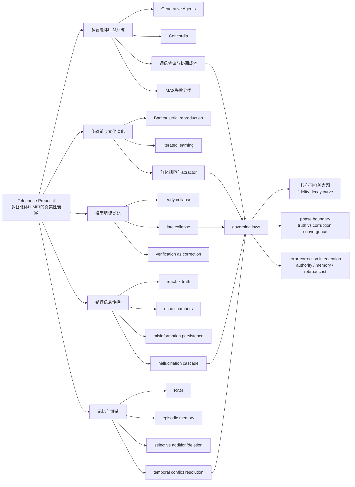

# 面向你这份 Telephone Proposal 的深度文献研究报告

## 执行摘要

尽管你的原始指令把 proposal 设定为“未提供”，但你实际附带的草案已经把问题空间大幅收窄：核心命题是**多智能体 LLM 在 agent-to-agent 信息传递中会发生可测量的真实性衰减**，并希望把这种现象定位为一种**推理时、社会性的 model collapse 类比**，进一步研究其**衰减曲线、控制律、相变边界与纠错干预**。你的草案还明确了几个关键变量：网络连通性、模型能力、权威重广播、消息冗余、记忆结构，以及 fidelity / reached / version-share / corruption taxonomy 等指标。fileciteturn0file0

基于该草案，本报告没有把你的题目当成“完全未知”，而是采用“**以真实草案为中心、向五个相邻主题簇扩展**”的方式组织文献：**多智能体 LLM 系统与通信结构、传输链与文化演化、模型坍塌与合成数据退化、错误信息与谣言传播动力学、记忆/检索/纠错机制**。这样做的原因是：你的 proposal 真正想回答的问题，恰好位于这些文献群的交叉地带，而不是任何单一子领域内部。Generative Agents 与 Concordia 一类工作给了你“社会仿真与通信基础设施”；传输链与 iterated learning 文献给了你“信息如何在链式传递中系统性变形”的实验谱系；Shumailov 等关于 model collapse 的工作提供了“退化是可被理论化的”论证；错误信息传播研究告诉我们“reach 与 truth 从来不是一回事”；记忆与检索文献则直接对应你 proposal 中最重要的 C4——**能否把记忆结构视为 error-correction / anti-entropy 机制**。citeturn18view0turn19view3turn5search0turn16search0turn23view2turn21view1

从现有文献看，你的 proposal 有一个**真实而且不空泛的缺口**：多智能体 LLM 论文大量衡量的是任务成功率、协调效率、社会行为涌现、或信息扩散的 reach；但**对“传播后是否仍为真”这一 fidelity 维度，系统性、量化、跨条件的研究仍然很稀缺**。即便是最新工作，也多半只触及部分切片：例如多智能体错误传播、谣言传播模拟、或多轮协作中的 hallucination dynamics，却尚未把这些统一到“**truth–corruption attractor、phase boundary、error-correction protocol**”的框架里。这个判断不是文献中原话，而是我基于相邻领域文献拼接后的推断。citeturn23view3turn20search0turn14academia16turn24view0turn25view0turn1academia49turn1academia50

简言之，如果你要把这篇 proposal 打磨成强论文，最有力的定位不是“多智能体会犯错”，而是：**在一个可控社会仿真中，把 truth preservation 作为一等指标，量化它如何随 hops/rounds/拓扑/能力/记忆设计而衰减，并证明存在最小纠错干预可以把系统从 corruption-convergence 推回 truth-convergence**。这比单纯做一个新 agent framework 更有论文辨识度，也更贴近你草案中最有锋芒的部分。fileciteturn0file0

## 检索范围与主题假设

### 主题假设

虽然你的最初说明要求我先假设 3–5 个可能主题，但由于上传草案已经明确方向，我采用以下 **五个主题簇** 来组织检索与回顾：

| 主题簇 | 与 proposal 的关系 |
|---|---|
| 多智能体 LLM 系统与通信结构 | 提供 agent society、通信协议、协调成本、失败模式与实验基础设施 |
| 传输链实验与文化演化 | 提供“telephone / serial reproduction / iterated learning”的经典方法论谱系 |
| 模型坍塌与合成数据退化 | 提供“递归退化可被建模”的理论与类比框架 |
| 错误信息、谣言与传播动力学 | 提供 reach vs truth、错误扩散与版本竞争的外部参照 |
| 记忆、检索与纠错机制 | 对应 proposal 中的 authoritative rebroadcast、memory architecture、anti-entropy 干预 |

### 检索策略

本次检索采用“**数据库检索逻辑 + 原始论文页复核**”的方式执行。数据库层面，优先设计如下检索路径：

| 主题簇 | 关键词组合示例 | 数据库 |
|---|---|---|
| 多智能体 LLM | “multi-agent LLM communication fidelity”, “LLM-based multi-agent systems communication”, “agent society simulation truth propagation” | Google Scholar, Web of Science, arXiv, ACM DL |
| 传输链 / cultural transmission | “transmission chain experiment”, “iterated learning serial reproduction”, “telephone game information distortion”, “cultural transmission fidelity” | Google Scholar, Web of Science, arXiv, JSTOR/出版社页面 |
| model collapse | “model collapse synthetic data”, “recursive training generative models”, “self-consuming generative models”, “synthetic retraining verification” | Google Scholar, Web of Science, arXiv, Nature |
| misinformation / rumor | “misinformation propagation social networks”, “false news diffusion”, “rumor spreading LLM agents”, “hallucination propagation multi-agent” | Google Scholar, Web of Science, arXiv, PubMed, Science/PNAS |
| memory / correction | “retrieval augmented generation factuality”, “LLM agent memory error propagation”, “long-term memory agent evaluation”, “temporal reasoning memory LLM agents” | Google Scholar, Web of Science, arXiv, ACM DL |

时间范围默认设为**近 10 年**，即 **2016-06-18 至 2026-06-18**；但对你的 proposal 来说，**若某篇更早工作构成方法论源头或经典基线**，则纳入例外文献，例如 Bartlett 的 serial reproduction、Kirby 的 iterated learning、RAG 的 2020 奠基工作等。文献优先级排序为：**原始期刊/会议论文 > 权威综述 > 高质量预印本**。对 2025–2026 的 arXiv 新文，我在分析中会明确标出其“前沿但尚未充分同行评审”的性质。citeturn5search0turn15search0turn16search0turn1search0

### 纳入与排除标准

纳入标准是：  
一类，能直接支撑你的核心命题：多智能体通信、信息传递、失真、纠错、记忆、社会仿真。  
二类，虽不直接研究 LLM agent fidelity，但提供**方法谱系或理论类比**，例如 transmission chains、iterated learning、model collapse。  
三类，提供**近五年的关键前沿进展**，尤其是 2025–2026 年关于 multi-agent error propagation、communication tax、memory benchmarks 的新工作。citeturn14academia16turn24view0turn25view0turn22view2

排除标准是：  
与多智能体或信息衰减关系弱、只讨论通用 agent 框架但无通信/记忆/传播内容、或者只提供工程描述而无法支持你的研究设计。

## 分主题文献分析

### 多智能体 LLM 系统与通信结构

这一簇文献回答的是：**agent society 是如何被搭起来的、agent 是如何通信的、通信失败长什么样、增加 agent 到底何时有益/有害**。它为你的 proposal 提供的是**实验容器与结构性对照**，但也暴露出一个关键缺口：这些工作通常衡量的是**行为可信度、任务成功率、协调效率、失败分类**，而不是字面意义上的“truth fidelity”。citeturn18view0turn23view3turn20search0turn14academia16

| APA 引用 | 研究问题 | 方法论 | 主要结果 | 优点与局限 | 对 proposal 的启发 |
|---|---|---|---|---|---|
| Park, J. S., O’Brien, J. C., Cai, C. J., Ringel Morris, M., Liang, P., & Bernstein, M. S. (2023). *Generative Agents: Interactive simulacra of human behavior*. UIST 2023. citeturn18view0turn1search0 | LLM agent 能否形成“可信”的个体与群体行为？ | 25-agent The Sims 风格沙盒；核心模块是 memory stream、基于 relevance/recency/importance 的检索、reflection、planning；采用受控 interview 式评估与两天端到端仿真。citeturn18view0turn19view1 | 论文最著名的案例是单点注入“Valentine’s Day party”后，邀请在两天内传播并协调成群体活动；消融显示 observation/planning/reflection 都关键。作者也明确指出常见错误包括**检索失败、记忆伪造、语言模型风格污染**。citeturn18view0 | **优点**：给出了 agent society 的经典架构与“信息扩散成功”的 canonical demo。**局限**：评估焦点在 believability 与 reach，不在 truth preservation。 | 这是你的最直接“前作对照组”：你可以复用它的社会仿真哲学，但把评价目标从“是否扩散/是否看起来合理”改成“是否仍然为真”。 |
| Vezhnevets, A. S., Agapiou, J. P., Aharon, A., et al. (2023). *Generative agent-based modeling with actions grounded in physical, social, or digital space using Concordia*. arXiv. citeturn2academia25turn2search1 | 如何构建更一般化、可配置的 generative ABM 框架？ | 采用 GM（Game Master）+ component system；agent 行为基于 LLM 调用与 associative memory retrieval；支持物理/社会/数字场景。citeturn19view3turn2academia25 | 主要贡献是**通用建模框架**而非单一 benchmark SOTA；强调 grounded scenario、模块化组件、环境控制与可扩展实验设计。citeturn2academia25turn19view3 | **优点**：非常适合做你 proposal 中的“仪器化社会实验平台”。**局限**：摘要未提供统一 fidelity 指标，也未把真值衰减作为研究核心。 | 你的“Telephone”最像是在 Concordia/Generative Agents 这一脉上补一条新指标轴：从 social behavior 转向 transmission fidelity。 |
| Yan, B., Zhang, X., Zhang, L., et al. (2025). *Beyond Self-Talk: A communication-centric survey of LLM-based multi-agent systems*. arXiv. citeturn13academia22turn23view3 | LLM-MAS 的核心应如何从“agent 功能”转向“通信协议”来理解？ | 提出 communication-centric taxonomy：系统级通信与系统内部通信两层框架，覆盖 architecture、goal、protocol、strategy、content。citeturn23view3 | 该综述的价值不在数值，而在于把 LLM-MAS 明确定义为**受通信协议约束的自动化系统**，直接把“通信”提升为一等分析对象。citeturn23view3 | **优点**：对你的 framing 极重要。**局限**：是综述，不提供 truth-decay 实证。 | 你可以借它把自己的工作界定为“communication quality/fidelity”研究，而非又一篇 agent engineering 论文。 |
| Cemri, M., Pan, M. Z., Yang, S., et al. (2025). *Why Do Multi-Agent LLM Systems Fail?* arXiv. citeturn20search0turn23view4 | 多智能体 LLM 系统为什么失败？ | 构建 MAST-Data，收集 1600+ annotated traces，覆盖 7 个 MAS 框架；结合 grounded theory 提炼 failure taxonomy。Berkeley 项目页还报告了 14 类失败模式，并举例说明 ChatDev 在 ProgramDev 上仅 33.33% correctness。citeturn23view4turn20search0 | 结果显示，失败并不只是“模型不够强”，而是大量源于**系统设计、交互错位、验证缺失**。citeturn20search0turn23view4 | **优点**：极有助于把你的 corruption taxonomy 做得更扎实。**局限**：它关心的是 general MAS failure，不是 truth-fidelity decay。 | 你 proposal 里的 stale-persistence / drift / fabrication / loss taxonomy，可以沿着 MAST 的 trace-oriented 精神来定义成更可审计的标签集。 |
| Kim, Y., Gu, K., Park, C., et al. (2025). *Towards a Science of Scaling Agent Systems*. arXiv. citeturn14academia16 | 多 agent 是否天然比单 agent 更好？有没有量化设计原则？ | 对 4 个 benchmark、5 种 canonical architecture、3 个 LLM family，共 180 个配置进行受控评估；建模 coordination efficiency、overhead、error amplification、redundancy，并建立预测模型。citeturn14academia16 | 核心数字非常重要：预测模型交叉验证 \(R^2=0.513\)；独立式结构会把错误放大 **17.2×**，集中式降到 **4.4×**；并行型任务可获益（金融推理 +80.9%），但顺序型推理任务多 agent 全面退化 **39–70%**；当单 agent 能力超过约 **45%** 时，协调带来的收益开始转负。citeturn14academia16 | **优点**：是你 proposal 中“governing laws / phase boundary”最接近的邻居。**局限**：研究终点仍是 task performance，不是 truth-version dynamics。 | 这篇是你最该正面回应的近邻：它告诉你“phase boundary”是可做的，但你需要把边界从“performance 最优”改成“truth-convergence 与 corruption-convergence 的相变”。 |

### 传输链实验与文化演化

这一簇文献为你的 proposal 提供的不是工程组件，而是**方法谱系**。如果你把“Telephone”写成一篇只属于 LLM engineering 的论文，会显得窄；但如果把它写成**Bartlett 式 serial reproduction 在 LLM agent society 中的现代重演**，你的论文会更有理论重量。citeturn17search4turn3search0turn3search2turn15search0

| APA 引用 | 研究问题 | 方法论 | 主要结果 | 优点与局限 | 对 proposal 的启发 |
|---|---|---|---|---|---|
| Bartlett, F. C. (1932). *Remembering: A study in experimental and social psychology*. Cambridge University Press. citeturn17search4turn17search0 | 人类记忆与复述是否是“复制”，还是“重构”？ | 经典的 serial reproduction / “telephone”范式，考察故事在重复复述中的结构性变形。citeturn17search0turn17search4 | Bartlett 的核心结论是：记忆不是机械保真，而是受 schema 驱动的重构性过程，内容会被文化习惯与已有知识框架改写。citeturn17search0 | **优点**：为你的研究提供最强的历史祖先。**局限**：时代久远、定量控制有限、对象是人而非 agent。 | 你 proposal 的“corruption taxonomy”完全可以被阐释为 Bartlett 式重构偏差在 LLM 社会中的机器版本。 |
| Kirby, S., Cornish, H., & Smith, K. (2008). *Cumulative cultural evolution in the laboratory: An experimental approach to the origins of structure in human language*. *PNAS, 105*(31), 10681–10686. citeturn3search0 | 在 iterated learning 下，随机语言会不会变得更有结构？ | 实验室人工语言经由代际传递；比较多轮传递后结构性与可学习性如何变化。citeturn3search0 | 结果显示，经过重复传递，最初随机的信号系统会逐渐形成更有组织、可学习、可表达的结构。citeturn3search0 | **优点**：说明传递链会系统性塑造 message form，而非只随机噪声。**局限**：关注的是结构出现，不是 factual truth 保持。 | 对你最重要的启发是：失真不一定是“坏噪声”，它可能是向某种 attractor 收缩；你的 corrupted consensus 正可以用这个视角解释。 |
| Mesoudi, A., & Whiten, A. (2008). *The multiple roles of cultural transmission experiments in understanding human cultural evolution*. *Philosophical Transactions of the Royal Society B, 363*(1509), 3489–3501. citeturn3search2 | transmission chain 实验在文化演化中能研究什么？ | 综述 transmission chain、replacement method 等实验范式，讨论 content bias、who/what/when/how of transmission。citeturn3search2 | 文中明确指出 transmission chain 方法可用来识别内容偏好和传播偏差，是研究文化传递机制的核心实验工具。citeturn3search2 | **优点**：为你的方法选择提供正统社会科学背书。**局限**：综述不是 LLM/agent 实证。 | 你可以把 proposal 的 M0–M3 设计写成 transmission chain methodology 在 LLM 社会中的可控扩展，而不是“我们自己发明了一套实验”。 |
| Ren, Y., Guo, S., Labeau, M., Cohen, S. B., & Kirby, S. (2020). *Compositional languages emerge in a neural iterated learning model*. arXiv. citeturn3academia59 | 神经代理在 iterated learning 下是否会形成更强组合性语言？ | 提出 neural iterated learning；让神经通信代理在代际学习中反复重置/传承。citeturn3academia59 | 结果表明，NIL 促进更结构化语言涌现，并提高泛化能力与学习效率。citeturn3academia59 | **优点**：直接把 transmission-chain 传统桥接到 neural agent communication。**局限**：对象是 emergent language，不是自然语言 factual updates。 | 很适合支持你的“衰减不是纯随机，而是有规律的结构化退化”这一主张。 |
| Ashery, A. F., Aiello, L. M., & Baronchelli, A. (2025). *Emergent social conventions and collective bias in LLM populations*. *Science Advances, 11*, eadu9368. citeturn15search0turn26view0 | LLM agent 群体能否自发形成社会规范、偏见与 tipping dynamics？ | 在去中心化 LLM population 中进行 pairwise interaction，考察 convention emergence、collective bias、committed minority 效应。citeturn26view0turn26view1 | 结果显示：LLM 群体可自发形成统一 convention；即便个体无偏，群体层面仍会出现 collective bias；少数 committed agents 可以推动社会规范切换。citeturn26view0turn26view1 | **优点**：直接证明 LLM 社会会形成群体 attractor，而不是简单平均。**局限**：任务更像 norm formation，不是 factual transmission。 | 这篇几乎是你 proposal 中“truth-convergence vs corruption-convergence”概念的社会动力学先导。 |

### 模型坍塌与合成数据退化

这一簇并不直接研究 agent-to-agent communication，但它给了你 proposal 最有传播力的比喻：**当模型在训练时吃自己的输出，会退化；那么，当 agent 在推理时不断把别的 agent 生成物当上下文，也可能发生社会性的退化**。请注意，这是一种**有力但需要谨慎表述的类比**：它现在是 research framing，不是公认术语。fileciteturn0file0 citeturn5search0turn27view0turn28view0

| APA 引用 | 研究问题 | 方法论 | 主要结果 | 优点与局限 | 对 proposal 的启发 |
|---|---|---|---|---|---|
| Shumailov, I., Shumaylov, Z., Zhao, Y., et al. (2024). *AI models collapse when trained on recursively generated data*. *Nature, 631*, 755–759. citeturn5search0turn19view5 | 递归使用生成数据训练后续模型，会发生什么？ | 从离散分布、Gaussian、GMM、VAE 到 LLM 递归训练进行理论与实验分析；LLM 部分以 OPT-125m 和 WikiText2 微调为例。citeturn19view5 | 论文提出 early/late model collapse：先丢失 tail，再向低方差点估计塌缩。LLM 例子中，真实数据微调的 perplexity 可从 zero-shot **115** 降到 **34**；但递归生成训练会导致低概率信息消失、重复模式积累，且 repetition penalty 也不能阻止 collapse。citeturn19view5 | **优点**：最强的理论类比来源。**局限**：研究的是训练时递归，不是通信时传播。 | 你的“social / inference-time model collapse”最好写成**类比性 framing**，并明确说你研究的是 communication channel 上的保真退化，而非训练分布退化本身。 |
| Alemohammad, S., Casco-Rodriguez, J., Luzi, L., et al. (2023). *Self-Consuming Generative Models Go MAD*. arXiv. citeturn28view2turn28view3 | 如果生成模型反复吃自己的输出，会怎样？ | 对图像生成模型的三类 autophagous loops 做分析，考察不同 real-data refresh 条件下 precision/recall 的变化。citeturn28view2turn28view3 | 主结论很直接：如果每一代没有足够 fresh real data，未来生成模型的**质量（precision）或多样性（recall）会持续下降**。citeturn28view3 | **优点**：把“退化”表述成质量–多样性权衡，很适合做传播 fidelity 的类比。**局限**：图像生成，不是 agent 社会。 | 对你可借鉴的点是：不要只看 truth 准确率，也要看**版本多样性/分裂程度**，否则会错过“低多样性但高一致的错误共识”。 |
| Seddik, M. E. A., Chen, S.-W., Hayou, S., Youssef, P., & Debbah, M. (2024). *How bad is training on synthetic data? A statistical analysis of language model collapse*. arXiv. citeturn27view0 | 语言模型的 synthetic retraining collapse 能否被严格刻画？ | 建立 next-token statistical model；分析 fully synthetic 和 partially synthetic 两种递归训练情景，并给出理论边界。citeturn27view0 | 论文证明：**纯 synthetic 训练下 collapse 不可避免**；混合 real + synthetic 时，存在一个 synthetic-data 上限，低于该上限 collapse 才可能被抑制。还给出 GPT2-style 经验验证。citeturn27view0 | **优点**：把“阈值/上界”概念正式化。**局限**：仍是训练分布，不是 agent communication graph。 | 你 proposal 中的 connectivity × capability phase boundary，非常适合借用这类“阈值存在性”的写法。 |
| Hu, Z., Rostami, M., & Thomason, J. (2025). *Multi-modal synthetic data training and model collapse: Insights from VLMs and diffusion models*. arXiv. citeturn5academia46 | model collapse 在 multimodal / multi-model 条件下是否不同？ | 研究 VLM、diffusion 与 multiple-model generate-train loops。citeturn5academia46 | 结果表明：多模态情境下 collapse 特征并不完全等同于单模态；作者观察到 alignment 改善但 variance 上升，并提出更多 decoding budget、模型多样性、frozen-model relabeling 可缓解退化。citeturn5academia46 | **优点**：告诉你异质模型与 diversity 可能是缓解器。**局限**：还是数据训练，不是社会传播。 | 可直接启发你的 mixed-population 条件：异质 agent 群体未必更差，可能更抗塌缩。 |
| Yi, B., Liu, Q., Cheng, Y., & Xu, H. (2025). *Escaping model collapse via synthetic data verification: Near-term improvements and long-term convergence*. arXiv. citeturn28view0turn28view1 | 外部 verifier 能否阻止 synthetic retraining 的退化？ | 在线性回归、MNIST 上的 VAE、以及 SmolLM2-135M 的 XSUM 微调上，分析 verifier-guided retraining。citeturn28view0turn28view1 | 关键结论：**外部 verifier 的注入可阻止 collapse**；但如果 verifier 本身并不完美，早期收益会平台化，长期还会向 verifier 的“knowledge center”收敛。citeturn28view0 | **优点**：和你 proposal 中 authoritative rebroadcast / corrective memory 几乎同构。**局限**：研究的是训练回路中的 verifier，不是社会内的 re-broadcaster。 | 这是你 C4 最强的理论邻居：最小外部校验是否能把系统从 corruption attractor 拉回 truth attractor。 |

### 错误信息、谣言与传播动力学

这一簇提供的是**truth 与 spread 可分离**这一基本事实。你的 proposal 最大的亮点之一，就是把这种分离搬进 LLM agent society，并把它做成可控实验。传统社交媒体研究已经证明“传播快”与“传播真”不是同一回事；而 2025–2026 年的新工作开始直接在多智能体 LLM 中观察 misinformation persistence 与 hallucination cascade。citeturn16search0turn16search2turn24view0turn25view0

| APA 引用 | 研究问题 | 方法论 | 主要结果 | 优点与局限 | 对 proposal 的启发 |
|---|---|---|---|---|---|
| Del Vicario, M., Bessi, A., Zollo, F., et al. (2016). *The spreading of misinformation online*. *PNAS, 113*(3), 554–559. citeturn16search2turn16academia45 | 在线平台上的 misinformation 为什么容易形成扩散群？ | 基于 Facebook 的大规模定量分析，比较 conspiracy 与 scientific news 的消费与级联模式，并提出 signed-network percolation 模型。citeturn16search2turn16academia45 | 论文表明，错误信息的扩散与**同质性/极化社群**强相关；同一 echo chamber 内部会形成特有 cascade dynamics。citeturn16search2turn16academia45 | **优点**：给你“版本分裂、群体极化、局部共识”提供社会网络文献支撑。**局限**：人类社交媒体，不是 agent 系统。 | 你的 proposal 中“versions split across subgroups”与“connectivity phase boundary”可直接借用这类 echo-chamber 语言。 |
| Vosoughi, S., Roy, D., & Aral, S. (2018). *The spread of true and false news online*. *Science, 359*(6380), 1146–1151. citeturn16search0turn19view4 | 真新闻与假新闻的扩散动力学是否不同？ | 分析 2006–2017 年 Twitter 上经六家 fact-checking 机构核验的新闻扩散；考察 distance、depth、breadth、speed。citeturn19view4 | 数据规模是 **126,000** 条新闻、约 **300 万** 人、**450 万** 次转发。结果显示：falsehood 在几乎所有类别上都比 truth 传播得更远、更快、更深、更广，政治类最明显。citeturn19view4 | **优点**：最经典的“reach ≠ truth”证据。**局限**：传播主体是人类用户与平台机制。 | 这是你研究最该借用的外部对照：你的论文可以说，我们要在 agent society 中重建并解释这一分离现象。 |
| Hu, T., Liakopoulos, D., Wei, X., Marculescu, R., & Yadwadkar, N. J. (2025). *Simulating rumor spreading in social networks using LLM agents*. arXiv. citeturn25view2 | LLM agents 能否模拟谣言在社交网络中的传播？ | 设计多种 LLM agent persona、四种网络结构、上百 agents 与数千边的仿真框架。citeturn25view2 | 传播结果对 network structure、persona、spreading scheme 高度敏感，谣言影响范围从 **0%** 到 **83%** agents 不等。citeturn25view2 | **优点**：最接近你 proposal 的“agent 社会传播实验”形态。**局限**：主要研究 rumor reach，不是 factual fidelity。 | 这篇说明你的实验平台完全可实现，但你要把 outcome variable 从“影响多少 agent”升级为“agent 持有版本与真值的偏离度”。 |
| Becker, J., Wahle, J. P., Ruas, T., & Gipp, B. (2026). *Misinformation propagation in benign multi-agent systems*. arXiv. citeturn24view0 | 在没有恶意 agent 的情况下，错误信息会如何污染多 agent debate？ | 给 agent 注入 intent-based misinformation；比较单 agent 与 multi-agent debate；操控 misinformation relevance、group composition、decision protocol（voting vs consensus）。同时发布 MINT 数据集，含 **10,278** 条 misinformation texts、9 类 intent。citeturn24view0 | 结果表明：错误信息会降低单 agent 表现，并且在 MAD 中持续存在；不过当大多数成员未被污染时，多 agent debate 相比单 agent 可以部分缓解退化。consensus 在同伴压力下更稳定，而 majority 有时能把被误导 agent 拉回正确答案。citeturn24view0 | **优点**：直接触到你 proposal 的核心问题。**局限**：重点是任务表现与 robustness，不是 decay curve 和 attractor。 | 这篇几乎可以当成你的直接近邻与 baseline：你应该在它之上再多走三步——看 hops、看 version-share、看长期 attractor。 |
| Jamshidi, S., Moradi Dakhel, A., Nafi, K. W., & Khomh, F. (2026). *Hallucination Cascade: Analyzing error propagation in multi-agent LLM systems*. arXiv. citeturn25view0turn25view1 | 多 agent 顺序协作里，hallucination 是会放大还是衰减？ | 500 组 cascade 实验、10 个知识领域、3 个模型（GPT-5.3、DeepSeek-V3、LLaMA-3-70B），共 **1,250** 个响应；按 claim-level inconsistency 跟踪。citeturn25view0 | 非常值得注意的结果：3-agent chain 中 normalized hallucination score 从 **0.422** 降到 **0.272**，但 factual accuracy 也从 **0.789** 降到 **0.769**；每次 agent-to-agent refinement 平均减少 hallucination **0.072**，却伴随 factual preservation 下降。citeturn25view0turn25view1 | **优点**：首次把错误传播分解为“幻觉降低 ≠ 事实保真提高”的 trade-off。**局限**：前沿预印本，且关注 sequential cascade，不是社会网络相变。 | 这是你的论文必须正面引用的一篇：它直接支持你把 fidelity 定义为独立于 hallucination score 的一等指标。 |

### 记忆、检索与纠错机制

这部分与你草案中的 C4 最相关。结论很直白：**记忆不是纯增益项，它既可能是纠错器，也可能是误差放大器**。因此，你 proposal 中“currency-resolving memory”“authoritative rebroadcast”“anti-entropy”并不是附属变量，而很可能是全篇最具可操作性的干预主线。fileciteturn0file0 citeturn23view2turn21view1turn22view1

| APA 引用 | 研究问题 | 方法论 | 主要结果 | 优点与局限 | 对 proposal 的启发 |
|---|---|---|---|---|---|
| Lewis, P., Perez, E., Piktus, A., et al. (2020). *Retrieval-augmented generation for knowledge-intensive NLP tasks*. *NeurIPS 2020*. citeturn8academia24turn23view2 | 外部检索能否提高 factuality 与知识更新能力？ | 将 parametric memory 与 non-parametric memory 结合；在 open-domain QA、FEVER、MS-MARCO、Jeopardy question generation 等任务上评估。citeturn23view2 | RAG 在 Open NQ、WebQuestions、CuratedTrec 上创下 SOTA；在事实性评测中，人类评审认为 RAG 比 BART 更 factual 的比例为 **42.7%**，反过来只有 **7.1%**。同时在 FEVER 上接近 pipeline SOTA，且支持知识库替换更新。citeturn23view2 | **优点**：为“外部证据校正真值”提供最经典技术基座。**局限**：是单模型检索增强，不是多 agent 社会传播。 | 若你要做 authoritative re-broadcast，最简单可行的形式就是“经过 provenance 检索验证的权威更新重新广播”。 |
| Zhong, W., Guo, L., Gao, Q., Ye, H., & Wang, Y. (2023). *MemoryBank: Enhancing large language models with long-term memory*. arXiv. citeturn7academia61turn23view1 | 长期记忆能否改善连续互动中的记忆召回与响应质量？ | 构建长期对话记忆系统 SiliconFriend；基于遗忘曲线做记忆更新；进行真实对话 + 模拟对话双重评估。citeturn7academia61turn23view1 | 在 10 天对话记忆、194 个 probing questions 上，SiliconFriend-ChatGPT 的英文 retrieval accuracy 为 **0.763**、correctness **0.716**、coherence **0.912**；中文 correctness **0.655**、coherence **0.675**。citeturn23view1 | **优点**：早期但相当完整地表明 memory module 可被量化评估。**局限**：任务是 companion/chat，不涉及 conflicting updates 的社会传播。 | 可借鉴其 probing-style evaluation：把你 proposal 中 fidelity judge 设计成“面向 agent 的访谈式 probing”会很自然。 |
| Shinn, N., Cassano, F., Berman, E., Gopinath, A., Narasimhan, K., & Yao, S. (2023). *Reflexion: Language agents with verbal reinforcement learning*. arXiv. citeturn22view3 | 无需再训练权重，语言反思能否让 agent 用记忆自我改进？ | 用 verbal feedback 替代参数更新；把反思文本写入 episodic memory buffer，作为后续 trial 的 in-context guidance。citeturn22view3 | 在 HumanEval 上，Reflexion 的 pass@1 达到 **91%**，超过论文中提到的 GPT-4 **80%** 基线。citeturn22view3 | **优点**：说明 memory + reflection 可显著改善决策。**局限**：改进的是任务成功率，不是社群中的 factual stability。 | 你 proposal 中的“reflection memory / GA-reflection”完全可以借 Reflexion 重新解释为**局部纠错器**。 |
| Xu, W., Liang, Z., Mei, K., Gao, H., Tan, J., & Zhang, Y. (2025). *A-MEM: Agentic memory for LLM agents*. arXiv. citeturn10academia12turn21view0 | memory 不应只是“存和取”，能否 agentic 地自组织、链接、演化？ | 受 Zettelkasten 启发，自动生成结构化 note、links、keywords/tags，并允许旧记忆在新证据到来时更新其上下文表征。citeturn21view0 | 摘要报告其在 **6 个 foundation models** 上优于现有 SOTA baselines，但未在摘要统一列出单一性能数字。citeturn21view0 | **优点**：比静态 vector retrieval 更贴近“版本更新/记忆演化”。**局限**：摘要对具体基准数字不充分。 | 对你的 proposal 很关键，因为“community center → community shed”这类 drift，往往需要链接式、可演化的记忆才能追踪。 |
| Xiong, Z., Lin, Y., Xie, W., He, P., Tang, J., Lakkaraju, H., & Xiang, Z. (2025). *How memory management impacts LLM agents: An empirical study of experience-following behavior*. arXiv. citeturn21view1 | 记忆管理究竟如何影响长期 agent 行为？ | 系统研究两种操作：addition 与 deletion；比较三类 agent、三类任务；分析 error propagation 与 misaligned experience replay。citeturn21view1 | 论文明确发现 experience-following property；同时指出两类副作用：**error propagation** 与 **misaligned replay**。引入 selective addition + combined deletion 后，平均获得 **10% 绝对性能提升**。citeturn21view1 | **优点**：这篇最直接证明“memory 可能把旧错带进未来”。**局限**：是 task-level memory management，不是群体传播动力学。 | 这是你 C4 的关键依据之一：memory architecture 不只是控制变量，它可能决定系统是过相变边界还是留在错误 attractor。 |
| Banerjee, P., Moshtaghi, M., Subramanian, S., Misra, A., & Chadha, A. (2026). *APEX-MEM: Agentic semi-structured memory with temporal reasoning for long-term conversational AI*. arXiv. citeturn22view0turn22view1 | 如何让记忆系统理解“事实会随时间变化”，并在检索时解决冲突？ | 采用 property graph、append-only temporal storage、retrieval-time conflict resolution。citeturn22view0 | 在 LOCOMO QA 上达到 **88.88%**，在 LongMemEval 上达到 **86.2%**，优于 session-aware SOTA。citeturn22view0turn22view1 | **优点**：与你的“Saturday→Sunday 更新被旧版本压制”的问题高度同构。**局限**：目前场景偏会话记忆，不是 agent society。 | 这几乎就是你所需的“currency-resolving memory”模板：保留全时序轨迹，但在检索层面解决冲突与版本更新。 |

## 跨类别综合判断与比较

### 你这份 proposal 最稳的学术定位

把以上五簇文献放在一起后，你的 proposal 最有竞争力的定位不是一般性的“multi-agent reliability”，也不是常见的“debate whether helps reasoning”，而是：

**把 agent-to-agent transmission 明确建模为 lossy channel，研究 truth 在社会传播中的衰减规律，以及什么最小干预能把社会从 corruption attractor 拉回 truth attractor。** 这个定位与 Generative Agents/Concordia 的社会仿真基础设施相连，与 Bartlett/Kirby 的 transmission-chain 方法谱系相连，与 Shumailov 的 model collapse 形成类比，与 misinformation 文献中的 reach-vs-truth 分离形成经验支撑，又与 memory/error-correction 文献形成可操作干预变量。citeturn18view0turn19view3turn3search0turn17search4turn5search0turn16search0turn21view1turn22view1

### 最值得直接对照的代表作

| 论文 | 方法/系统 | 数据/环境 | 指标/核心结果 | 对你的价值 |
|---|---|---|---|---|
| Park et al., 2023 | 记忆+反思+规划的 25-agent society | The Sims 风格仿真 | 展示 reach 与 social behavior；未测 fidelity。citeturn18view0 | 你的“直接前作”，最适合作为对照基线 |
| Cemri et al., 2025 | 多 agent failure taxonomy | 1600+ traces, 7 frameworks | 14 类失败模式，强调系统设计而非单模型问题。citeturn20search0turn23view4 | 为 corruption taxonomy 提供方法论 |
| Kim et al., 2025 | 180 个受控配置的 MAS scaling | 4 benchmarks, 5 architectures, 3 LLM families | 错误放大 17.2× vs 4.4×；顺序任务多 agent 退化 39–70%。citeturn14academia16 | 为“governing laws / phase boundary”提供最近邻 |
| Ashery et al., 2025 | LLM population social convention | 去中心化群体互动 | convention、bias、minority tipping 可自发出现。citeturn26view0 | 支撑 attractor / tipping dynamics |
| Shumailov et al., 2024 | recursive synthetic training | GMM/VAE/LLM | early/late collapse；tail 先消失。citeturn19view5 | 为“social model collapse”提供类比根基 |
| Vosoughi et al., 2018 | 社交平台新闻扩散分析 | 126k stories, 3M users | falsehood farther/faster/deeper/broader。citeturn19view4 | 把 reach 与 truth 分离立住 |
| Becker et al., 2026 | benign MAD misinformation injection | reasoning/knowledge/alignment 任务 | misinformation 持续存在；group composition 和 protocol 决定鲁棒性。citeturn24view0 | 是你最接近的 contemporaneous baseline |
| Jamshidi et al., 2026 | claim-level hallucination cascade | 500 cascades, 10 domains | hallucination 降，factual accuracy 也降。citeturn25view0 | 证明“去幻觉”不等于“保真” |
| Xiong et al., 2025 | selective add/delete memory | 3 agents × 3 tasks | 平均 +10% 绝对提升；发现 error propagation。citeturn21view1 | 支撑 memory as correction variable |
| Banerjee et al., 2026 | temporal graph memory | LOCOMO, LongMemEval | 88.88 / 86.2。citeturn22view0turn22view1 | 对“版本更新冲突解决”最有工程启发 |

### 当前最明显的研究空白

从文献覆盖面看，以下空白最适合变成你的贡献点：

第一，**reach 和 fidelity 被长期混用**。Generative Agents、Concordia、OASIS、AgentSociety 证明了信息会扩散、群体现象会涌现，但未把“扩散之后还是否为真”作为主指标。citeturn18view0turn2academia25turn1academia49turn1academia50

第二，**多 agent 错误传播文献开始出现，但仍以任务正确率为终点**。Becker 和 Jamshidi 已经说明 misinformation 与 hallucination 会在多 agent 环境中改变结果，但还没有形成你 proposal 里那种系统性的衰减曲线、phase boundary、version-share attractor 分析。这个判断是综合性推断。citeturn24view0turn25view0turn14academia16

第三，**“记忆是纠错器还是污染源”尚未被嵌入社会扩散框架**。现有 memory 文献多在单 agent 或单会话环境中谈长期表现，而你的 proposal 能把 memory architecture 放进 agent society，让它成为 phase transition 的控制旋钮。citeturn21view1turn22view1turn21view0

第四，**缺少可复现、可审计的 truth-provenance instrumentation**。你的草案里特别强调用 provenance 重新定义 reached，并把 judge rubric 预注册，这一点非常对，因为它正好避开了很多 MAS 论文的最大软肋：只看最后答案，不看传播轨迹、版本分叉与证据来源。fileciteturn0file0 citeturn20search0turn20academia24

## 研究主题与方法关系图

## 建议阅读顺序与后续研究方向

### 建议阅读顺序

如果目标是**最快把 proposal 写成能投稿的 literature review + method section**，我建议按下面顺序读：

1. **Park et al., 2023, Generative Agents**：先吃透 agent society 的 canonical 叙事与你要“纠偏”的位置。citeturn18view0  
2. **Vezhnevets et al., 2023, Concordia**：理解如何把社会仿真变成可控研究工具，而非 demo。citeturn2academia25  
3. **Vosoughi et al., 2018** 与 **Del Vicario et al., 2016**：建立 reach 与 truth 分离的外部经验基础。citeturn19view4turn16search2  
4. **Bartlett, 1932** 与 **Mesoudi & Whiten, 2008**：为“Telephone 不是噱头，而是正统 transmission-chain 方法”奠基。citeturn17search4turn3search2  
5. **Shumailov et al., 2024**：把“social model collapse”写成谨慎但有力的理论类比。citeturn19view5  
6. **Kim et al., 2025** 与 **Cemri et al., 2025**：学习怎样把多 agent 行为写成“laws / scaling / failure modes”，而不是 anecdote。citeturn14academia16turn20search0  
7. **Becker et al., 2026** 与 **Jamshidi et al., 2026**：这是你最近的直接邻域，必须正面比较。citeturn24view0turn25view0  
8. **Xiong et al., 2025** 与 **APEX-MEM, 2026**：直接服务你 C4 的干预设计。citeturn21view1turn22view0  

### 建议的后续研究方向清单

- **把 fidelity 指标正式化为多层指标**：命题正确性、细节保真、时效正确性、版本一致性、来源可追溯性，而不只是一维 FAQ-style accuracy。这个建议直接回应你草案中对 fidelity / reached / taxonomy 的拆分。fileciteturn0file0  
- **显式建模 attractor 与 phase boundary**：至少要扫 connectivity × capability × memory architecture 三维，不然“governing laws”会停留在描述层。Kim 等已经证明多 agent scaling 可以被定量建模；你需要把终点变量换成 truth-corruption dynamics。citeturn14academia16  
- **把纠错干预设计成最小可证伪机制**：优先试三类——authoritative rebroadcast、provenance-aware retrieval、temporal conflict-resolving memory。对应文献邻居分别是 verifier-guided collapse mitigation、RAG、APEX-MEM。citeturn28view0turn23view2turn22view0  
- **引入 heterogeneous populations**：最新多模态 synthetic-data 与多 agent coordination 文献都提示，异质性有时能缓解一致性塌缩，不应只测 homogeneous swarm。citeturn5academia46turn14academia16  
- **做 trace-level 可审计分析，而不是只看终局答案**：MAST 与 TraceSIR 一类工作说明，最终答案会丢掉最重要的过程信息；你的 proposal 已经意识到这一点，应该继续强化。citeturn20search0turn20academia24  
- **至少准备两到三个结构不同的 update scenario**：例如时间更新、地点更新、人物属性更新。否则很容易被评审认为只是某一种 prompt-specific artifact。你的草案已经把这点列为风险与缓解，是正确方向。fileciteturn0file0  

### 总体判断

如果你按当前草案继续推进，我的直白判断是：**你最该避免的，不是“实验做不出来”，而是把题目写窄成一个 agent benchmark 小修小补**。真正强的版本应该明确宣称：

- 你研究的不是“多 agent 是否更聪明”，  
- 也不是“多 agent 是否更鲁棒”，  
- 而是**“真值在 agent society 中如何衰减、何时塌缩、何时可被纠回”**。  

这个问题在现有文献的交叉处确实存在空白，而且你的草案已经有了比多数 MAS 论文更成熟的实验意识：预注册指标、provenance-based reached、human-audited judge、multi-seed + CI、taxonomic error analysis。只要后续把 literature positioning 写得更锋利、把指标定义得更硬，你这题目是有机会从“有趣现象”升级成“可投稿贡献”的。fileciteturn0file0