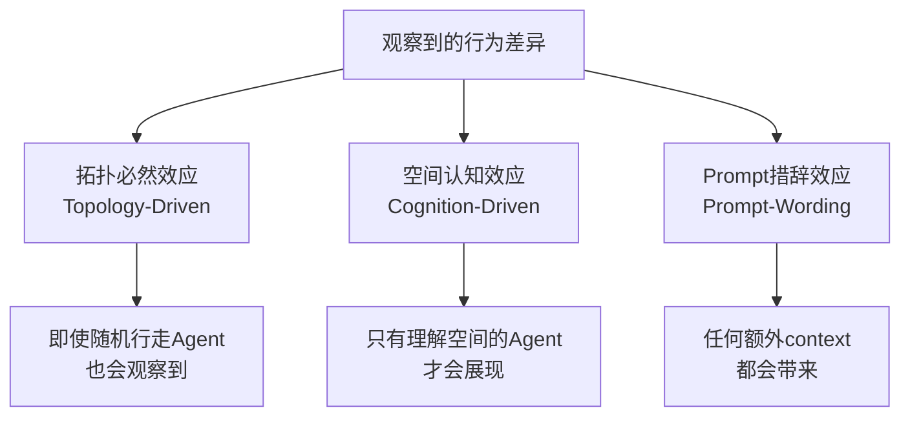
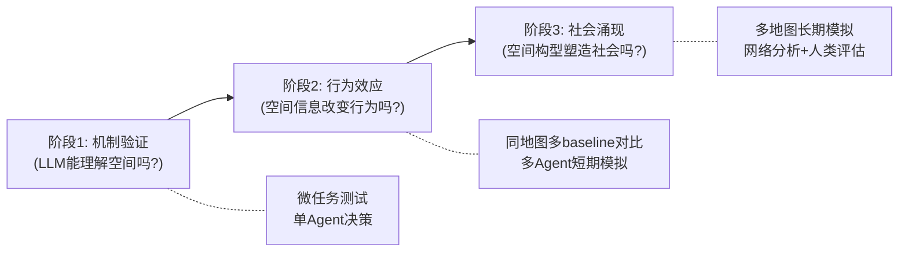

# SpatialAgent 研究计划深度评审报告 v2

> **评审身份**：跨学科资深评审（HCI + AI + 建筑学方法论）  
> **评审对象**：[spatial_agent_research_plan_v1.md](file:///Users/mac/Documents/6-Research/1-SpatialAgent/spatial_agent_research_plan_v1.md)  
> **评审日期**：2026-03-15  
> **评审定位**：本报告与已有的 [challenge 文档](file:///Users/mac/Documents/6-Research/1-SpatialAgent/spatial_agent_research_plan_challenge.md) 和 [reviewer_critique_v1](file:///Users/mac/Documents/6-Research/1-SpatialAgent/spatial-agent/docs/reviewer_critique_v1.md) 互补，聚焦**它们未充分覆盖的盲点**

---

## 📊 总体评价

| 维度 | 评分 (1-10) | 说明 |
|------|:-----------:|------|
| 选题新颖性 | **9** | 跨学科桥接非常漂亮，Space Syntax × LLM Agent 确实是空白 |
| 理论深度 | **5** | Space Syntax 的使用停留在"借指标"层面，缺乏真正的理论对话 |
| 方法严谨性 | **4** | 因果识别、baseline 设计、统计方案均有显著缺陷 |
| 实验可行性 | **6** | 技术路线基本合理，但时间线偏紧、模块过多 |
| 预期影响力 | **7** | 如果做得好，可以开辟一个新的研究方向 |
| **综合** | **5.5** | **Idea 一流，执行计划二流——需要大幅修改后才能投稿** |

> [!IMPORTANT]
> 核心判断：这个 idea 值 AAAI/CHI 的门票，但当前计划如果原样执行，最可能的结果是**审稿人觉得有趣但证据不够硬**，拿到 borderline reject。问题不在"做不做"，而在"怎么做才能站得住"。

---

## 第一类：理论层面的深层问题

### 🔴 问题1：Space Syntax 理论被"工具化降级"了

你当前对 Space Syntax 的使用方式是：

```
理论 → 提取4个数值指标 → 转成自然语言 → 喂给LLM
```

这不是"引入理论"，这是**借了几个变量名**。Hillier 的 Space Syntax 核心论点是：

> **空间构型本身就是一种社会信息编码——空间关系即社会关系。**

但你的系统里，空间只是一组被传给 LLM 的特征值。LLM 并不"理解"空间构型——它只是读到了一段描述文字。这就像说"我们引入了经济学理论"，但实际只是把 GDP 数字塞进了 prompt。

**为什么这是问题**：

审稿人（尤其是了解 Space Syntax 的）会质疑：

> "你声称引入了 Space Syntax 理论，但你实际只用了4个数值指标。Space Syntax 的核心贡献是关于**空间构型如何作为社会关系的基础设施**——你的系统里这个洞察在哪里体现？"

**修改方向**：

1. **在理论框架中区分两个层次**：
   - **指标层**（你现在做的）：用 Integration/Connectivity 等作为空间特征输入
   - **构型层**（你缺的）：讨论空间拓扑结构如何**内在地**约束 Agent 的相遇概率、信息流通路径、社交网络形态
2. **明确你的理论贡献不是"证明 Space Syntax 对 LLM 有效"**，而是"探索 Space Syntax 的空间-社会映射原理是否在 LLM Agent 社会中依然成立"
3. 在 Discussion 中与 Hillier 的原始理论进行**真正的对话**——你的实验结果在哪些方面验证了 Hillier，在哪些方面与建筑学的经验发现不一致？为什么？

---

### 🔴 问题2：从建筑学到虚拟世界的"迁移合法性"未被论证

Space Syntax 的所有经验验证都基于**真实物理空间中的真实人类行为**：

- 行人在伦敦街道上的自然运动（Hillier et al., 1993）
- 博物馆参观者的路径选择（Choi, 1999）
- 办公室中的偶遇性交流（Penn et al., 1997）

你的研究场景是：**文字描述的虚拟空间中的 LLM Agent 行为**。

这里有两个巨大的跳跃需要论证：

| 跳跃 | 从 → 到 | 为什么需要论证 |
|------|---------|---------------|
| 跳跃1 | 真实人类 → LLM Agent | LLM 是否具有类似人类的空间-行为直觉？ |
| 跳跃2 | 物理空间 → 文字描述的空间 | 纯文字描述的空间拓扑是否能产生与物理空间相同的行为效应？ |

**当前计划完全没有讨论这两个跳跃**。审稿人会问：

> "Space Syntax 在真实世界有效，是因为人类有身体、有视觉、有空间直觉。LLM 没有这些，你凭什么假设同样的空间指标对 LLM 也有效？"

**修改方向**：

1. **在理论框架中增加一节**：讨论 LLM 为什么可能具有隐含的空间-社会常识（因为训练数据中包含大量关于空间行为的描述）
2. **将 Exp1 重新定位**：不是"验证空间感知提升可信度"，而是"测试 LLM 是否具有空间-行为映射的隐含知识，以及显式空间特征注入是否能激活这种知识"
3. **在 Discussion 中坦诚讨论迁移的局限性**

---

### 🟡 问题3：5个假设的理论基础不均匀

| 假设 | 理论支撑强度 | 问题 |
|------|:-----------:|------|
| H1（高Integration→更多社交） | ⭐⭐⭐⭐ | 最经典的 Space Syntax 发现，有大量实证支持 |
| H2（低Visual Depth→透露秘密） | ⭐⭐ | 过度简化——低视觉深度同样意味着不安全 |
| H3（高Control Value→领导者涌现） | ⭐ | Control Value 对应的是"门卫/瓶颈"，不是"领导者" |
| H4（Connectivity→信息传播速度） | ⭐⭐⭐ | 合理，但可能只是图论必然结果而非 Agent 认知效应 |
| H5（不同构型→不同涌现模式） | ⭐⭐ | 太笼统，难以证伪 |

**H3 是最危险的假设**。在 Space Syntax 文献中，Control Value 高的节点是"守门人"（gatekeeper）位置，不是"领导者"位置。一个必经之路的收费站操作员并不是社区领袖。把空间控制直接映射为社会领导力，是一种**未经论证的比喻跳跃**。

**修改方向**：

1. **H2 改为双向假设**：低 Visual Depth 可能增加私密行为倾向，但也可能增加防御行为倾向——改为"Visual Depth 会 modulate 信息分享行为的概率分布"
2. **H3 大幅修改**：从"涌现领导者"改为"涌现信息中介/守门角色"——这与 Control Value 的建筑学含义一致
3. **H5 具体化**：指定你期望看到的差异维度（如网络密度、信息扩散半衰期），否则任何差异都能"验证"假设，假设变成不可证伪

---

## 第二类：方法论层面的关键缺陷

### 🔴 问题4：你的"涌现"可能只是"数学必然"

这是之前两份评审都提到但**没有给出足够具体解决方案**的核心问题。

考虑你的 Plaza 构型：广场节点连接最多空间，Integration 最高。在你的模拟中，Agent 的移动部分受 Spatial Planning 模块控制，会倾向于去高 `social_opportunity` 的地方。所以：

```
高 Integration → 你的算法让更多 Agent 去那里 → 更多社交发生在那里 → "验证"了 H1
```

这不是涌现，这是**你的效用函数的直接输出**。审稿人一眼就能看穿。

同理，Labyrinth 构型中路径少、瓶颈多 → Agent 被**物理拓扑**限制了相遇机会 → 社交网络碎片化 → "验证"了 H5。但这跟 Agent 是否"理解"空间毫无关系——换成随机行走的粒子也会得到类似结果。

**这是整篇论文最大的生死问题**：你需要区分三种效应：



**修改方向——必须增加的对照条件**：

| 对照条件 | 目的 | 具体设计 |
|---------|------|---------|
| **Random Walk Agent** | 度量拓扑必然效应的下界 | Agent 随机选择相邻节点移动，到达后执行标准 LLM 对话（无空间信息） |
| **Topology-Only Agent** | 分离拓扑效应 vs 认知效应 | Agent 使用与 SpatialAgent 相同的移动算法（Spatial Planning），但对话时不注入空间描述 |
| **Shuffled-Signal Agent** | 验证正确空间信息的必要性 | 给 Agent 注入错误的空间描述（A地点的指标配B地点的名字） |
| **Rich-Context Agent** | 排除"更多上下文=更好"效应 | 给 Agent 注入等长度的非空间环境描述（天气、历史故事、NPC衣着） |

如果 `SpatialAgent > Topology-Only > Random Walk`，你才能说空间认知有额外贡献。
如果 `SpatialAgent > Rich-Context`，你才能说不只是"更多 context"的功劳。
如果 `SpatialAgent > Shuffled-Signal`，你才能说正确的空间信息是关键。

---

### 🔴 问题5：LLM-as-Judge 的自嗨问题被严重低估

你的评估体系高度依赖 LLM-as-Judge（GPT-4o 评分）。问题是：

**生成模型和评估模型共享相同的语言偏好**。如果 SpatialAgent 的输出因为空间描述而变得更具体、更"详细"、更"有细节感"，GPT-4o 作为 Judge 会天然倾向给高分——因为它的训练数据中，"具体详细的文本"通常被标注为"高质量"。

这意味着你可能测到的是：

> **"LLM 更喜欢自己生成的、包含空间细节的文本"** ≠ **"Agent 行为更可信"**

**具体的危险案例**：

```
# SpatialAgent 输出（有空间信息）
Elara 环顾四周确认密室里只有她和 Theron，
低声说道："货物明晚通过暗道运入..."

# Baseline Agent 输出（无空间信息）  
Elara 说："我有一批货要运，明晚行动。"
```

GPT-4o Judge 几乎必然给第一个更高分——因为它更"生动"、更"有画面感"。但这不代表第二个不可信。

**修改方向**：

1. **Judge Rubric 必须明确排除表面特征**：
   - ❌ 不评分：文本是否生动、是否有环境描写、是否提到了空间
   - ✅ 只评分：行为决策本身是否符合该空间的社会规范（例如"是否应该在广场大声讨论走私"）
2. **使用结构化行为标注替代开放评分**：
   - 不要问"这个对话质量如何（1-5分）"
   - 改为问"这个 Agent 做了什么行为？（选项：公开讨论/低声讨论/拒绝讨论/转移话题）"——然后你来判断该行为是否 spatially appropriate
3. **交叉模型验证**：生成用模型A，评估用模型B和模型C，报告跨模型一致性
4. **增加人类评估的权重和严谨性**（见下方问题7）

---

### 🟡 问题6：Spatial Memory Retrieval 的设计过于"硬编码"

你的空间记忆检索公式：

```
spatial_similarity = 1.0 (同一地点) / 0.7 (相邻) / 0.5 (同类型) / 0.1 (其他)
```

这些数值是从哪里来的？为什么同一地点是 1.0 而不是 0.9？为什么相邻是 0.7 而不是 0.6？

更重要的是，心理学中的"场景依赖记忆"效应的强度依赖于**编码时的体验深度**——你在一个地方待了10分钟和待了3小时，场景依赖效应是不同的。你的公式完全忽略了这一点。

**修改方向**：

1. **权重不要硬编码**——至少要做超参数搜索或消融实验来验证这些数值的合理性
2. 考虑用 **embedding-based spatial similarity** 替代规则：把空间特征向量化，用余弦相似度自然计算空间相似性
3. **α=0.4, β=0.2, γ=0.1, δ=0.3 这组权重需要 justify**——为什么空间比时效性（recency）更重要三倍？这违反直觉

---

## 第三类：实验设计的具体问题

### 🟡 问题7：人类评估设计存在多个方法论漏洞

| 问题 | 具体表现 | 影响 |
|------|---------|------|
| **样本量不足** | 25-30人，6个条件 → 每条件约5人评估 | 统计功效极低 |
| **被试来源偏差** | "从游戏玩家社区招募" | 游戏玩家对空间敏感度远高于一般用户 |
| **评估材料的提示性** | 给被试看空间描述+对话 | 空间描述本身可能暗示"正确答案" |
| **缺乏 inter-rater reliability** | 未提及一致性检验 | 无法判断评分是否可靠 |
| **Likert量表过于粗糙** | 1-5分，只有3个问题 | 信息量不足以支撑多维度结论 |

**修改方向**：

1. **样本量**：至少需要 40-50 人才能对 2-3 个条件做有意义的统计比较
2. **双盲设计**：评估者不知道哪组是 SpatialAgent，材料中不暴露系统信息
3. **材料设计**：给评估者看的应该是**地图位置示意图 + 对话内容**，而不是空间语言描述
4. **增加 attention check 和 inter-rater agreement 报告**（Krippendorff's α 或 Fleiss' κ）
5. **增加一个关键控制问题**："你是否觉得 NPC 的行为被人为操控/引导了？"——如果评分高，说明你的方法太"刻意"

---

### 🟡 问题8：200轮模拟的统计独立性问题

200轮对话**不是**200个独立样本。在同一次模拟运行中：

- 第100轮的对话受到前99轮的累积影响
- Agent 的记忆池在不断增长
- 社交关系在不断演化

所以真正的独立样本数是**运行次数**（5次重复），不是200×5=1000。

用 n=5 做 t 检验：

```
统计功效 = 极低
→ 结果不显著 ≠ 没有效应（可能是样本太少）
→ 结果显著 = 需要非常大的效应量才能检测到（这在社会科学中不常见）
```

**修改方向**：

1. **增加重复次数到至少 10-15 次**（不同随机种子）
2. **使用 Mixed-Effects Model**：将 run 作为随机效应，round 作为嵌套效应，agent pair 作为重复测量
3. **明确定义每个假设的分析单元**：
   - H1（社交频率）：分析单元 = 每个 run 中高Integration区域 vs 低Integration区域的社交事件密度
   - H2（秘密透露）：分析单元 = 每次秘密透露事件发生时的空间属性
4. **预注册分析计划**——避免被质疑 p-hacking

---

### 🟡 问题9：三种地图构型的设计缺乏"控制变量"严谨性

三种地图同时改变了太多变量：

| 变量 | Plaza | Labyrinth | Grid |
|------|:-----:|:---------:|:----:|
| 中心节点数 | 1 | 0 | 3 |
| 平均Connectivity | 高 | 低 | 中 |
| 死胡同数量 | 少 | 多 | 无 |
| 平均路径长度 | 短 | 长 | 中 |
| Integration方差 | 高 | 低 | 中 |
| 是否有Cycle | 少 | 少 | 多 |

审稿人会说：

> "你观察到的差异，到底是因为中心节点数不同，还是因为平均路径长度不同，还是因为死胡同数量不同？你无法区分。"

**修改方向**：

1. **保留三种地图作为"整体构型对比"**（ecological validity）
2. **增加"最小差异对"实验**：两张地图只在一个关键属性上不同
   - 对A：同一地图，但将中心广场拆成两个小广场（改变 Integration 分布，保持其他不变）
   - 对B：同一地图，但给某些通道加/减遮挡（改变 Visual Depth，保持拓扑不变）
3. 这样可以更干净地回答"哪个空间属性在起作用"

---

## 第四类：之前评审未覆盖的新问题

### 🟠 问题10：Text-based RPG 环境的生态效度问题

你选择 text-based 环境的理由是"无需游戏引擎，方便复现"。但这带来一个严重的生态效度问题：

**Space Syntax 的所有经验验证都基于视觉空间体验**——人类能看到空间、能感受空间的开阔或封闭。在纯文本环境中：

- Agent 不"看到"空间，只"读到"空间
- 没有视觉感知，Visual Depth 变成一个**完全抽象的数字**
- 没有身体，spatial affordance 只是语义概念

审稿人会问：

> "你的 Visual Depth 在文本世界里到底意味着什么？Agent 又不能'看'。"

**修改方向**：

1. **在论文中坦诚讨论这个局限**，而不是回避
2. **重新定义你的 Visual Depth**：在文本世界中，它不是"能看到多远"，而是"对空间开放性的语义理解"——需要明确这一抽象化的合理性
3. **考虑增加一个最小视觉化方案**：即使不用完整游戏引擎，也可以生成简单的 ASCII 地图或 2D 俯视图，让 multimodal LLM "看到"空间布局

---

### 🟠 问题11：Agent 的移动模型严重不足

当前计划对 Agent 如何在空间中移动的描述极为模糊。你有 Spatial Planning 模块决定"去哪里"，但没有讨论：

1. **移动的时间成本**：从A到B需要几轮？Agent 在路上会遇到其他 Agent 吗？
2. **多 Agent 的空间冲突**：一个节点能容纳多少 Agent？满了怎么办？
3. **路径上的偶遇机制**：Agent 在移动过程中经过中间节点时，是否与在场的其他 Agent 交互？
4. **停留时间模型**：Agent 在一个地点停多久？是固定的还是自适应的？

这些细节**直接影响你的实验结果**。如果路径偶遇被忽略，那 Labyrinth 中线性通道上的大量潜在社交机会就被丢失了，这会人为地低估 Labyrinth 的社交密度。

**修改方向**：

1. **明确定义移动模型的所有参数**
2. **在预实验中验证**：不同移动模型参数设定下，结果是否稳健
3. 考虑 Hu et al. (2024) survey 中关于 RPG 类游戏 Agent 移动的讨论

---

### 🟠 问题12：LLM 的空间推理能力被高估了

最新研究表明，LLM 在**空间推理任务上的表现远不如常识推理**。例如：

- LLM 在回答"A在B北边，B在C西边，A在C的什么方向？"这类问题时经常出错
- LLM 对拓扑关系的理解很弱——给出一个图结构，LLM 很难正确推断最短路径

你的整个系统假设 LLM 能够**根据空间描述自然地调整行为**。但如果 LLM 本身就不善于空间推理，那么：

- 简单的空间描述可能足够（"这里很隐蔽" → LLM 理解）
- 复杂的空间关系可能被忽略（"你的位置控制了通往3个区域的必经之路" → LLM 可能无法理解这意味着什么）

**修改方向**：

1. **增加一个预实验**：测试你选择的 LLM 在读到你的空间描述后，是否能正确回答关于空间属性的问题（如"你觉得这个地方适合私密对话吗？""从你的位置能观察到几个方向的人？"）
2. **这个预实验的结果应该指导你的 Spatial-to-Language Converter 的设计**——如果 LLM 理解不了复杂空间关系，就需要把描述简化到它能理解的粒度
3. 引用 LLM spatial reasoning 的相关文献作为 limitation 讨论

---

### 🟠 问题13：与 Embodied AI 文献的关系没有讨论

你的 Related Work 里缺少一个重要的研究方向：**Embodied AI / Embodied Agents**。

在 Embodied AI 领域，研究者已经在让 Agent 理解和推理他们所处的物理环境：

- **SayPlan** (Rana et al., 2023)：使用3D场景图进行大规模任务规划
- **SQA3D** (Ma et al., 2023)：3D场景中的情境问答
- **LEO** (Huang et al., 2024)：通用 embodied multi-modal agent

这些工作与你的研究高度相关，因为它们也在解决"Agent 如何理解空间"的问题，只是在不同的抽象层级上。

**修改方向**：

1. 在 Related Work 中增加 Embodied AI 的讨论
2. 明确你的工作与 Embodied AI 的区别：你关注的是**空间构型的社会含义**，而非**空间中的物理操作**
3. 讨论未来将 Space Syntax 应用于 Embodied Agent 的可能性

---

## 第五类：策略层面的建议

### 📋 建议1：收缩论文主张——从"证明"到"探索"

| 当前主张 | 建议修改 |
|---------|---------|
| "首次将 Space Syntax 引入 LLM Agent 领域" | "据我们所知，这是最早将建筑学空间构型分析方法应用于 LLM 多 Agent 社会模拟的工作之一" |
| "证明空间构型对多Agent社会行为具有显著塑造效应" | "提供控制性实验证据，表明空间结构化表征与 Agent 交互模式之间存在系统性关联" |
| "空间失明——所有LLM游戏Agent" | "现有 LLM Agent 架构普遍缺乏对空间构型的显式建模" |
| "预期结论：Visual Depth和Integration影响最大" | 删除预期结论中的具体方向性预测，改为"我们将通过消融实验系统性地评估各空间特征的相对贡献" |

---

### 📋 建议2：重构实验为三阶段递进设计

当前的 Exp1-4 是平行设计，缺乏递进逻辑。建议改为：



**阶段1（2周）**：微任务验证
- 给单个 Agent 不同空间描述，测试它是否做出不同且合理的行为选择
- 比较不同表征方式（数值 / 中性描述 / 解释性描述 / 错配信号）
- 这一步如果失败，后续实验就不需要做了

**阶段2（4周）**：同地图行为效应
- 在同一张地图上比较 SpatialAgent vs 多个 baseline
- 200轮 × 15次重复
- 核心指标：BSC（行为空间一致性）和 SDR（秘密透露合理性）

**阶段3（4周）**：多地图涌现分析
- 只有阶段2证明了空间认知效应显著，才进入此阶段
- 3种构型 × SpatialAgent + Topology-Only Agent 对照
- 网络分析 + 人类评估

---

### 📋 建议3：精简架构——主论文只保留2个核心模块

| 模块 | 主论文 | 理由 |
|------|:------:|------|
| Spatial Perception | ✅ | 核心创新点，空间→语言转换 |
| Spatial Action Sampling | ✅ | 确保空间对行为的可控影响 |
| Spatial Memory Retrieval | ❌→附录 | 增加复杂性，难以 clean ablation |
| Spatial Planning | ❌→附录 | 容易被认为是"硬编码效用函数"，削弱 LLM 贡献 |

理由：当你只用2个模块时，效果的归因更清晰。如果4个模块全上，审稿人会问"到底是哪个模块起作用"，而你4个消融 × 3地图 × 多baseline的实验量会爆炸。

---

### 📋 建议4：投稿策略调整

| 目标会议 | 适配度 | 需要强化的点 |
|---------|:------:|------------|
| **AAAI-27** | ⭐⭐⭐ | 方法严谨性、baseline 公平性、统计分析 |
| **CHI 2027** | ⭐⭐⭐ | 人类评估深度、用户体验、设计启示 |
| **AAMAS 2027** | ⭐⭐⭐⭐ | 多Agent涌现行为、空间构型效应——最匹配 |
| **CSCW 2027** | ⭐⭐⭐ | 社会行为分析视角 |

> [!TIP]
> **AAMAS（国际自主Agent与多Agent系统会议）** 可能是最佳首选目标。它的审稿人更理解多Agent社会模拟，对"空间构型影响Agent行为"这种研究问题更有共鸣，也不会像 AAAI 那样对 prompt engineering 的质疑那么尖锐。

---

## 🎯 优先修改事项排序

> [!CAUTION]
> 以下按优先级排序。前3项如果不解决，论文几乎不可能通过严格审稿。

| 优先级 | 问题 | 修改行动 | 预计额外时间 |
|:------:|------|---------|:-----------:|
| **P0** | 区分拓扑效应 vs 认知效应（问题4） | 增加 Random Walk + Topology-Only + Shuffled 三个对照条件 | +2周实验 |
| **P0** | LLM-as-Judge 自嗨（问题5） | 重新设计评估 rubric，增加结构化行为标注 | +1周设计 |
| **P0** | 理论使用过于肤浅（问题1） | 重写理论框架，与 Hillier 进行真正的理论对话 | +1周写作 |
| **P1** | 假设不严谨（问题3） | 修改 H2/H3/H5 的表述 | +2天 |
| **P1** | 人类评估设计（问题7） | 增加样本量，改双盲设计 | +2周执行 |
| **P1** | 统计独立性（问题8） | 增加重复次数，使用 Mixed-Effects Model | +1周分析 |
| **P2** | 迁移合法性论证（问题2） | 增加理论讨论 | +3天写作 |
| **P2** | 构型控制变量（问题9） | 增加最小差异对实验 | +1周实验 |
| **P2** | LLM空间推理预测试（问题12） | 设计并执行预实验 | +3天 |
| **P3** | 环境生态效度（问题10） | Discussion 中讨论 | +1天 |
| **P3** | 移动模型（问题11） | 明确参数定义 | +2天 |
| **P3** | Embodied AI 文献（问题13） | 扩展 Related Work | +1天 |

---

## 💬 总结：一句话给作者

> **你的 idea 是一把好剑，但目前的实验设计是一块软豆腐——剑再好，砍在豆腐上也见不了血。请先把实验设计打磨成钢板，再来谈"首次证明"。**

具体来说：

1. **缩小主张**：从"证明空间构型因果塑造社会涌现"降为"提供控制性证据，表明空间结构化表征系统性地影响 Agent 交互模式"
2. **收紧实验**：增加 3-4 个公平 baseline，改三阶段递进设计
3. **精简架构**：主论文只保留 Perception + Action Sampling，其余放附录
4. **加深理论**：不只是"借指标"，要与 Hillier 进行真正的理论对话
5. **修好评估**：LLM-as-Judge rubric 重设计 + 人类评估扩大 + 增加结构化标注

做完这些修改后，这将是一篇非常有竞争力的论文。
